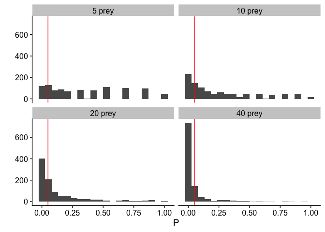

Chapter 10 Sample Answers
================
Justin Touchon
8/3/2021

This page provides sample answers to the assignment at the end of
Chapter 10 of Applied Statistics with R: A Practical Guide for the Life
Sciences by Justin Touchon. Chapter 10 focuses on *Writing Loops and
Functions*. This chapter teaches you how to write your own functions to
either automate tasks you need to do repeatedly or to simulate data so
that you can better understand your experiments and what might happen.

There was essentially a three-stage assignment at the end of Chapter 10
involving the simulation function we built throughout the chapter. Since
the different parts of the assignment are all quite closely tied
together, I’ve put them all here at the top of the page but we will work
through them one-by-one.

<span style="color: #009933;">

# Question

**1. Modify the final version of the function we wrote (*predTrialSim*)
to include another argument which allows you to vary the number of prey
animals in each predation trial.**

**2. Pick at least four values for the number of prey in each trial and
make a meaningful plot which explores how detecting a statistically
significant difference in predators varies with the size of the pool of
animals in each trial.**

**3. Which is more important, running more trials or running trials with
more animals?**

</span>

Here is the final version of *predTrialSim* we made. In this version, we
can alter the number of predation trials we are running and what
proportion of prey each predator eats, on average.

``` r
predTrialSim<-function(numTrials,predLevelA,predLevelB)
{
  #Build the empty data frame
  simData<-data.frame(Trial=rep(1:numTrials,times=2),
                    Pred=rep(c("PredA","PredB"),
                             each=numTrials), Eaten=NA, NotEaten=NA)
  #Simulate the predation trials
  PredA_trials<-rbinom(numTrials,10,predLevelA)
  PredB_trials<-rbinom(numTrials,10,predLevelB)
  simData$Eaten[simData$Pred=="PredA"]<-PredA_trials
  simData$Eaten[simData$Pred=="PredB"]<-PredB_trials
  simData$NotEaten<-10-simData$Eaten
  #run the GLM and return just the p-value
  simGLM<-glm(cbind(Eaten,NotEaten)~Pred, data=simData, family="binomial")
  return(Anova(simGLM)$Pr)
}
```

The assignment asks us to introduce a new argument which will allow us
to modify how many prey animals are used in each trial. In the current
version, the number of prey is fixed at 10 per trials. But if we replace
that number with an argument, let’s call it *numPrey* we can then adjust
the number of prey in different trials. Note that there are three places
where you need to replace the number *10* with the new argument
*numPrey*.

``` r
predTrialSim<-function(numTrials,predLevelA,predLevelB,numPrey)
{
  #Build the empty data frame
  simData<-data.frame(Trial=rep(1:numTrials,times=2),
                    Pred=rep(c("PredA","PredB"),
                             each=numTrials), Eaten=NA, NotEaten=NA)
  #Simulate the predation trials
  PredA_trials<-rbinom(numTrials,numPrey,predLevelA)
  PredB_trials<-rbinom(numTrials,numPrey,predLevelB)
  simData$Eaten[simData$Pred=="PredA"]<-PredA_trials
  simData$Eaten[simData$Pred=="PredB"]<-PredB_trials
  simData$NotEaten<-numPrey-simData$Eaten
  #run the GLM and return just the p-value
  simGLM<-glm(cbind(Eaten,NotEaten)~Pred, data=simData, family="binomial")
  return(Anova(simGLM)$Pr)
}
```

We can verify it worked by running a few examples. Don’t forget that
since our function uses the **Anova()** function from the ***car***
package, we will need to make sure that is loaded. Later on we will need
***ggplot2*** and ***cowplot*** as well.

``` r
library(car)
```

    ## Loading required package: carData

``` r
library(ggplot2)
library(cowplot)
```

``` r
#Some trials with 10 prey
predTrialSim(numTrials=20,predLevelA=0.2,predLevelB=0.3,numPrey=10)
```

    ## [1] 0.2064432

``` r
predTrialSim(numTrials=20,predLevelA=0.2,predLevelB=0.3,numPrey=10)
```

    ## [1] 0.001424521

``` r
predTrialSim(numTrials=20,predLevelA=0.2,predLevelB=0.3,numPrey=10)
```

    ## [1] 2.5228e-05

``` r
#Some trials with 50 prey
predTrialSim(numTrials=20,predLevelA=0.2,predLevelB=0.3,numPrey=50)
```

    ## [1] 6.458207e-09

``` r
predTrialSim(numTrials=20,predLevelA=0.2,predLevelB=0.3,numPrey=50)
```

    ## [1] 3.855289e-13

``` r
predTrialSim(numTrials=20,predLevelA=0.2,predLevelB=0.3,numPrey=50)
```

    ## [1] 0.000108438

Okay, so that seems like it has worked. Step 1 complete! The second part
of the assignment asks us to pick four different values for the number
of prey in each trial and then to plot the results. For this, we will be
essentially replicating the code on page 303 of the book, but now
instead of changing the number of trials, we will be changing the number
of prey in each trial.

For the sake of comparison with what we did in the book, I’m going to
choose the same predation levels for our two predators (50% and 60%) and
we’ll imagine we are doing 10 trials in total.

``` r
predSims.5<-replicate(1000,predTrialSim(numTrials=10,predLevelA=0.5,predLevelB=0.6,numPrey=5))
predSims.10<-replicate(1000,predTrialSim(numTrials=10,predLevelA=0.5,predLevelB=0.6,numPrey=10))
predSims.20<-replicate(1000,predTrialSim(numTrials=10,predLevelA=0.5,predLevelB=0.6,numPrey=20))
predSims.40<-replicate(1000,predTrialSim(numTrials=10,predLevelA=0.5,predLevelB=0.6,numPrey=40))
```

Okay, now we are reading to combine these separate data frams into a
single object and plot them, just like what we did in the book. I’ve
also used the *labeller=* argument in **facet\_wrap()** to modify the
labels at the top of each of the faceted panels.

``` r
#Combine simulations into a single data frame
predSims<-data.frame(Reps=rep(c(5,10,20,40), each=1000), P=c(predSims.5, predSims.10, predSims.20, predSims.40))
#Plot the data
qplot(data=predSims, x=P, geom="histogram", bins=20)+ 
  facet_wrap(facets=Reps~., 
             labeller=labeller(Reps=c("5"="5 prey","10"="10 prey","20"="20 prey","40"="40 prey")))+ 
  geom_vline(xintercept=0.05, color="red")+ 
  theme_cowplot()
```

<!-- -->

We can also calculate the actual probability of detecting a significant
result as we increase the number of prey in each trial.

``` r
sum(predSims.5<0.05)/1000
```

    ## [1] 0.187

``` r
sum(predSims.10<0.05)/1000
```

    ## [1] 0.325

``` r
sum(predSims.20<0.05)/1000
```

    ## [1] 0.521

``` r
sum(predSims.40<0.05)/1000
```

    ## [1] 0.814

If we compare that to the numbers on page 305 in the book, we can make a
direct appraisal of the power of increasing sample size via reps or the
number of individuals in each trial. As we increase from 5 to 10 to 20
to 40 trials, our probability of finding a significant result goes from
about 18% to 32% to 51% to 80%.

So what’s the answer? Both are important! You can achieve adequate
statistical power both via having more replicates AND via having more
individuals in each replicate. Thus, when you are planning an experiment
you have two options for how you can maximize your power. In a perfect
world of course, you could do both! Perhaps choosing a middle ground for
each is the best strategy. For example, conducting 20 replicates and
having 20 prey per trial also yields about an 80% chance of detecting a
statistically significant difference between our two hypothetical
predators, which only differ by 10% in their predation efficacy.

``` r
predSims.20<-replicate(1000,predTrialSim(numTrials=20,predLevelA=0.5,predLevelB=0.6,numPrey=20))
sum(predSims.20<0.05)/1000
```

    ## [1] 0.807
