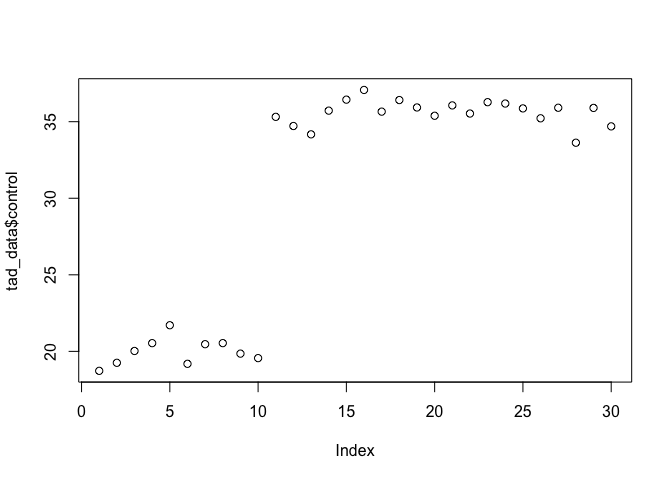

Chapter 1 Sample Answers
================
Justin Touchon
7/19/2021

This page provides sample answers to the assignment at the end of
Chapter 1 of Applied Statistics with R: A Practical Guide for the Life
Sciences by Justin Touchon. Since the assignment is very open-ended,
these answers are truly meant to be *examples* and are not the only
answers you can get. My hope is that you are here either because 1) you
want to check the answers you got to make sure you completed the
assignments correctly, or 2) you got stumped and need some help. Either
way, you will learn much more if you have already spent some time
working through the assignments on your own. If you haven’t done that,
close this page and go work on it! :)

<span style="color: #009933;">

# Assignment 1

**Create a data frame that contains at least one factor with three
categories and at least three columns of made up numeric data. Thus, it
should have at least four columns. Make sure the columns have meaningful
names. Have at least 10 rows per categories (i.e., at least 30 rows
long).**

</span>

How should you go about doing this? As with anything in R, there are of
course many different ways. I will show you how I would do it. The basic
idea here is to make a data frame with four columns and one of those
columns needs to be a factor with three categories.

Let’s start by making the factor. Since the data this book will be
working with are ecological data about red-eyed treefrog tadpoles, I
will stick with that general genre of data. Let’s imagine our three
categories are three different species of treefrogs. Let’s choose
hourglass treefrogs (the species pictured on the cover of the book),
which we will abbreviate “HGTF”, red-eyed treefrogs, which will be
“RETF”, and Rosenberg’s gladiator frog, or “GLDF”.

<div class="figure">


<p class="caption">
Three beautiful treefrogs from Central America. Photos by Justin
Touchon.
</p>

</div>

In order to make our factor, we can combine the functions **rep()** and
**c()**. Each species abbreviation is repeated 10 times, and those
vectors are concatenated together to make a single vector.

``` r
#We first create our vector of species codes
species<-c(rep("HGTF",times=10), rep("RETF",times=10), rep("GLDF",times=10))
#By typing in the name of the vector, we can verify that it worked
species
```

    ##  [1] "HGTF" "HGTF" "HGTF" "HGTF" "HGTF" "HGTF" "HGTF" "HGTF" "HGTF" "HGTF"
    ## [11] "RETF" "RETF" "RETF" "RETF" "RETF" "RETF" "RETF" "RETF" "RETF" "RETF"
    ## [21] "GLDF" "GLDF" "GLDF" "GLDF" "GLDF" "GLDF" "GLDF" "GLDF" "GLDF" "GLDF"

If we want to specify that this should be a factor, we can do so with
the **as.factor()** function. Just assign the object over itself, as is
shown below.

``` r
species<-as.factor(species)
#Type the name of the object at the console to see the difference from the original version
species 
```

    ##  [1] HGTF HGTF HGTF HGTF HGTF HGTF HGTF HGTF HGTF HGTF RETF RETF RETF RETF RETF
    ## [16] RETF RETF RETF RETF RETF GLDF GLDF GLDF GLDF GLDF GLDF GLDF GLDF GLDF GLDF
    ## Levels: GLDF HGTF RETF

Next, we need to make our numeric variables. Perhaps our experiment
involves raising these tadpoles under three different conditions. For
the sake of example, let’s imagine that we raised them under three
different diets, which we will just call “control”, “dietA”, and
“dietB”. You could imagine that the control is what we always feed our
tadpoles, but diets A and B are experimental diets that we are
interested in understanding the effects of. Let’s also imagine that the
two experimental diets are most beneficial to a particular species.

Let’s create three numeric variables, one for each diet. Like above, we
need to concatenate together (using the **c()** function) three vectors
of numbers. We will create those numbers using the **rnorm()** function,
which creates a vector of numbers randomly selected from a normal
distribution with a given mean and standard deviation. If that doesn’t
make a lot of sense, don’t worry, the normal distribution will be
discussed in Chapter 3! Lastly, note that hourglass treefrog tadpoles
are considerably smaller than either red-eyed treefrog or gladiator frog
tadpoles, which are pretty similar in size.

``` r
#First, create a vector of total lengths measured from our hypothetical control diet. 
control<-c(rnorm(n=10, mean=20, sd=1), rnorm(n=10, mean=35, sd=1), rnorm(n=10, mean=35, sd=1))
#Next, we will create a vector of total lengths measured from our hypothetical experimental diet A.  
#Let's imagine that this diet really benefits the red-eyed treefrog tadpoles, which are the second set of 10 animals in our data frame.
dietA<-c(rnorm(n=10, mean=20, sd=1), rnorm(n=10, mean=45, sd=1), rnorm(n=10, mean=35, sd=1))
#Lastly, let's create a vector of total lengths measured from our hypothetical experimental diet B.  
#Let's imagine that this diet most benefits the gladiator frog tadpoles, which are the third set of 10 animals in our data frame.
dietB<-c(rnorm(n=10, mean=20, sd=1), rnorm(n=10, mean=35, sd=1), rnorm(n=10, mean=50, sd=1))
#We can see that these worked if we type the names of the vectors into the console.
control
```

    ##  [1] 20.31361 22.14768 21.08187 20.70614 19.23828 20.89512 19.05687 20.06519
    ##  [9] 20.08047 20.97976 37.11451 35.21507 36.77703 33.66605 34.77766 36.05046
    ## [17] 35.55547 35.30353 36.46081 36.73225 34.08800 33.73678 36.86742 35.02632
    ## [25] 34.75691 35.48640 34.80758 35.54155 34.89530 36.40373

``` r
dietA
```

    ##  [1] 19.22836 18.89128 21.15545 19.34881 19.45734 21.53869 20.30238 20.44095
    ##  [9] 18.90160 21.72651 45.21883 45.36040 45.55070 45.57791 44.86438 47.55661
    ## [17] 45.46082 46.09388 46.88733 45.88095 35.02179 37.12940 35.06674 35.26282
    ## [25] 35.88849 35.60184 36.31791 36.72679 34.17474 35.49594

``` r
dietB
```

    ##  [1] 20.70519 17.88362 20.22762 20.74964 20.52507 21.95970 19.70340 20.76152
    ##  [9] 19.11873 19.73730 34.93554 36.20762 35.48083 35.48212 35.92039 34.18028
    ## [17] 33.18957 35.34952 33.74438 35.05703 52.28038 51.57731 50.84571 49.40825
    ## [25] 48.44932 48.01628 49.20588 50.94687 47.79677 48.91317

Okay, now we have our four vectors. It’s time to combine them into a
data frame using the function **data.frame()**. Remember to assign your
new data frame to an object!

``` r
tad_data<-data.frame(species, control, dietA, dietB)
tad_data
```

    ##    species  control    dietA    dietB
    ## 1     HGTF 20.31361 19.22836 20.70519
    ## 2     HGTF 22.14768 18.89128 17.88362
    ## 3     HGTF 21.08187 21.15545 20.22762
    ## 4     HGTF 20.70614 19.34881 20.74964
    ## 5     HGTF 19.23828 19.45734 20.52507
    ## 6     HGTF 20.89512 21.53869 21.95970
    ## 7     HGTF 19.05687 20.30238 19.70340
    ## 8     HGTF 20.06519 20.44095 20.76152
    ## 9     HGTF 20.08047 18.90160 19.11873
    ## 10    HGTF 20.97976 21.72651 19.73730
    ## 11    RETF 37.11451 45.21883 34.93554
    ## 12    RETF 35.21507 45.36040 36.20762
    ## 13    RETF 36.77703 45.55070 35.48083
    ## 14    RETF 33.66605 45.57791 35.48212
    ## 15    RETF 34.77766 44.86438 35.92039
    ## 16    RETF 36.05046 47.55661 34.18028
    ## 17    RETF 35.55547 45.46082 33.18957
    ## 18    RETF 35.30353 46.09388 35.34952
    ## 19    RETF 36.46081 46.88733 33.74438
    ## 20    RETF 36.73225 45.88095 35.05703
    ## 21    GLDF 34.08800 35.02179 52.28038
    ## 22    GLDF 33.73678 37.12940 51.57731
    ## 23    GLDF 36.86742 35.06674 50.84571
    ## 24    GLDF 35.02632 35.26282 49.40825
    ## 25    GLDF 34.75691 35.88849 48.44932
    ## 26    GLDF 35.48640 35.60184 48.01628
    ## 27    GLDF 34.80758 36.31791 49.20588
    ## 28    GLDF 35.54155 36.72679 50.94687
    ## 29    GLDF 34.89530 34.17474 47.79677
    ## 30    GLDF 36.40373 35.49594 48.91317

Hooray, you did it! As discussed earlier, you could choose anything to
be your categories (e.g., strains of mice in a study, brands of cereal
to eat, species of plants) and anything for your numeric variables
(e.g., responses of mice to different tests, sugar, protein, and fat
content of cereals, growth rates of plants under three different light
conditions, etc.) Okay, onward and upward.

<span style="color: #009933;">

# Assignment 2

**Once you have a data frame, plot a histogram of your numeric
variables. Try to dress it up by adding color, changing the limits of
the axes, and adding a main title. How will you figure out how to do
that? Look at the help file for** hist()**.**

</span>

The basic goal here is to look at the values in your numeric vectors. If
you look at the help file for the **hist()** function (which can be done
by simply typing *?hist* in the console) you will see there are lots and
lots of options. All of those are *optional* except for *x*, which is
the vector of values you want to plot. In our data frame, we can access
our numeric vectors with the **$** operator. For example, if we want to
plot a histogram of the vector of sizes we measured in our control diet,
we can type the following:

``` r
hist(tad_data$control)
```

<!-- -->

If you do that, you might get something very unhelpful, like I have
here. In a function like **hist()**, R is going to try to choose a set
of divisions in the data which it *thinks* will be most useful, but we
can override them. Here, we want to set the number of *breaks* to use
when plotting the histogram. Let’s go with 20 and see what that looks
like.

``` r
hist(tad_data$control, breaks=20)
```

<!-- -->

We can see a cluster of data representing our smallest species and a
larger cluster o values representing the two larger species. You should
also notice that by default R names our x-axis the variable we provided
it. We can customize that by specify a new *label* for our x-axis, with
the *xlab=* argument. We can also add color with the *col=* argument.
Below, I’ve picked the color “seagreen” but you could of course pick
whatever you want. (hint: type **colors()** in the console)

``` r
hist(tad_data$control, breaks=20, xlab="Sizes of hypothetical tadpoles (mm)", col="seagreen")
```

<!-- -->

There are lots of other ways to dress up a figure. Play around with
changing the title with the *main==* argument, or play with the range
limits using *xlim=* or *ylim=*. You can even *add* one histogram to an
existing plot, using the *add=T* argument.

<span style="color: #009933;">

# Assignment 3

**Use the** plot() **function to try and plot your numeric and
categorical variables. What happens when you give R different types of
data to plot?**

</span>

The **plot()** function is a very basic and fundamental function in R.
We will explore its utility in the coming chapters, but for now let’s
explore what happens when we give it just a single vector of numbers.
For example, if we provide **plot()** with our factor variable “species”
it will plot a bar for each category with the height of the bar being
now many observations are in each category. In this case, that means
three bars that are each 10 high.

``` r
plot(tad_data$species)
```

<!-- -->

What happens if we provide a vector of numeric values? R will plot each
of the values in our vector on the y-axis, with the x-axis being the row
of value. Thus, **plot()** just starts at the first row of the data
frame and proceeds downward. In the figure below, the first 10 values
(which correspond to our HGTF animals, which were the smallest) are
smaller than values 11–30, which correspond to the two larger species.

``` r
plot(tad_data$control)
```

<!-- -->

In the coming chapters we will explore what happens if you provide
combinations of vectors as the x- and y-values, and we will begin
learning how to use the ***ggplot2*** package to make beautiful figures.
However, for now that’s it! Great job.
