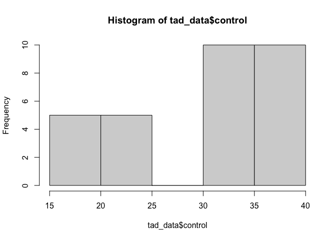
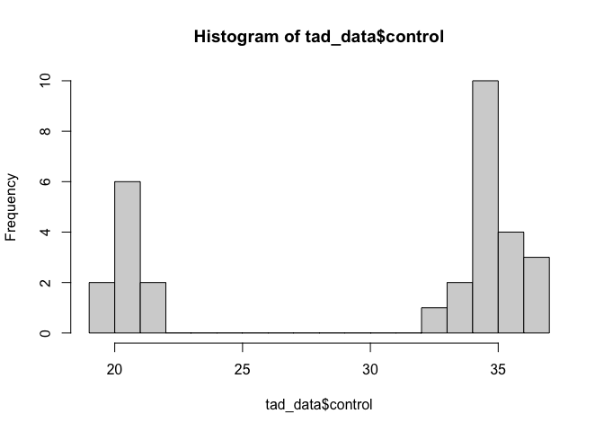
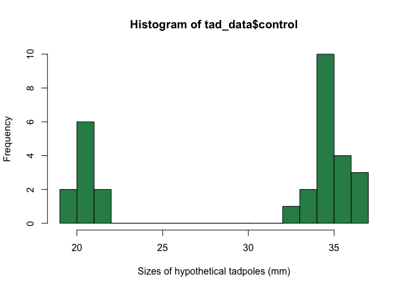
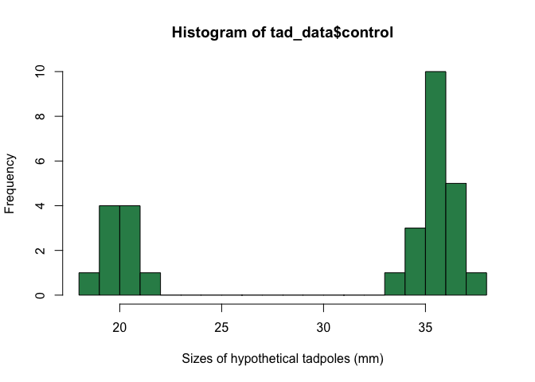
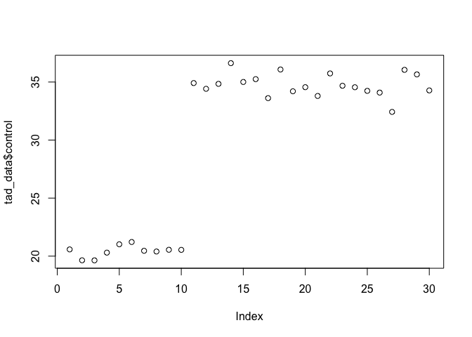

Chapter 1 Sample Answers
================
Justin Touchon
7/19/2021

This page provides sample answers to the assignment at the end of
Chapter 1 of Applied Statistics with R: A Practical Guide for the Life
Sciences by Justin Touchon. Since the assignment is very open-ended,
these answers are truly meant to be *examples* and are not the only
answers you can get. My hope is that you are here either because 1) you
want to check the answers you got to make sure you completed the
assignments correctly, or 2) you got stumped and need some help. Either
way, you will learn much more if you have already spent some time
working through the assignments on your own. If you haven’t done that,
close this page and go work on it! :)

<span style="color: #009933;">

# Assignment 1

**Create a data frame that contains at least one factor with three
categories and at least three columns of made up numeric data. Thus, it
should have at least four columns. Make sure the columns have meaningful
names. Have at least 10 rows per categories (i.e., at least 30 rows
long).**

</span>

How should you go about doing this? As with anything in R, there are of
course many different ways. I will show you how I would do it. The basic
idea here is to make a data frame with four columns and one of those
columns needs to be a factor with three categories.

Let’s start by making the factor. Since the data this book will be
working with are ecological data about red-eyed treefrog tadpoles, I
will stick with that general genre of data. Let’s imagine our three
categories are three different species of treefrogs. Let’s choose
hourglass treefrogs (the species pictured on the cover of the book),
which we will abbreviate “HGTF”, red-eyed treefrogs, which will be
“RETF”, and Rosenberg’s gladiator frog, or “GLDF”.

**ADD PHOTOS OF THE THREE SPECIES**

In order to make our factor, we can combine the functions **rep()** and
**c()**. Each species abbreviation is repeated 10 times, and those
vectors are concatenated together to make a single vector.

``` r
#We first create our vector of species codes
species<-c(rep("HGTF",times=10), rep("RETF",times=10), rep("GLDF",times=10))
#By typing in the name of the vector, we can verify that it worked
species
```

    ##  [1] "HGTF" "HGTF" "HGTF" "HGTF" "HGTF" "HGTF" "HGTF" "HGTF" "HGTF" "HGTF"
    ## [11] "RETF" "RETF" "RETF" "RETF" "RETF" "RETF" "RETF" "RETF" "RETF" "RETF"
    ## [21] "GLDF" "GLDF" "GLDF" "GLDF" "GLDF" "GLDF" "GLDF" "GLDF" "GLDF" "GLDF"

If we want to specify that this should be a factor, we can do so with
the **as.factor()** function. Just assign the object over itself, as is
shown below.

``` r
species<-as.factor(species)
#Type the name of the object at the console to see the difference from the original version
species 
```

    ##  [1] HGTF HGTF HGTF HGTF HGTF HGTF HGTF HGTF HGTF HGTF RETF RETF RETF RETF RETF
    ## [16] RETF RETF RETF RETF RETF GLDF GLDF GLDF GLDF GLDF GLDF GLDF GLDF GLDF GLDF
    ## Levels: GLDF HGTF RETF

Next, we need to make our numeric variables. Perhaps our experiment
involves raising these tadpoles under three different conditions. For
the sake of example, let’s imagine that we raised them under three
different diets, which we will just call “control”, “dietA”, and
“dietB”. You could imagine that the control is what we always feed our
tadpoles, but diets A and B are experimental diets that we are
interested in understanding the effects of. Let’s also imagine that the
two experimental diets are most beneficial to a particular species.

Let’s create three numeric variables, one for each diet. Like above, we
need to concatenate together (using the **c()** function) three vectors
of numbers. We will create those numbers using the **rnorm()** function,
which creates a vector of numbers randomly selected from a normal
distribution with a given mean and standard deviation. If that doesn’t
make a lot of sense, don’t worry, the normal distribution will be
discussed in Chapter 3! Lastly, note that hourglass treefrog tadpoles
are considerably smaller than either red-eyed treefrog or gladiator frog
tadpoles, which are pretty similar in size.

``` r
#First, create a vector of total lengths measured from our hypothetical control diet. 
control<-c(rnorm(n=10, mean=20, sd=1), rnorm(n=10, mean=35, sd=1), rnorm(n=10, mean=35, sd=1))
#Next, we will create a vector of total lengths measured from our hypothetical experimental diet A.  
#Let's imagine that this diet really benefits the red-eyed treefrog tadpoles, which are the second set of 10 animals in our data frame.
dietA<-c(rnorm(n=10, mean=20, sd=1), rnorm(n=10, mean=45, sd=1), rnorm(n=10, mean=35, sd=1))
#Lastly, let's create a vector of total lengths measured from our hypothetical experimental diet B.  
#Let's imagine that this diet most benefits the gladiator frog tadpoles, which are the third set of 10 animals in our data frame.
dietB<-c(rnorm(n=10, mean=20, sd=1), rnorm(n=10, mean=35, sd=1), rnorm(n=10, mean=50, sd=1))
#We can see that these worked if we type the names of the vectors into the console.
control
```

    ##  [1] 21.64204 20.62947 21.27535 20.74389 17.84875 22.65793 18.85693 20.17301
    ##  [9] 20.30312 19.24890 35.34287 35.18505 35.57346 35.12923 36.22404 34.41954
    ## [17] 34.43288 36.46078 34.30342 35.84689 36.31708 36.29152 35.13572 35.33941
    ## [25] 34.29751 35.06789 34.54109 35.46376 34.92198 34.51493

``` r
dietA
```

    ##  [1] 20.75073 20.26247 17.83814 19.66575 20.17135 21.58605 20.56737 19.02727
    ##  [9] 17.68901 19.20819 45.00281 46.61143 43.26321 43.13816 46.12438 45.39936
    ## [17] 45.27612 45.62998 44.44786 45.60031 34.33228 36.03027 36.79092 34.65450
    ## [25] 33.74465 35.05106 33.36750 34.63768 35.11426 34.08057

``` r
dietB
```

    ##  [1] 18.59630 18.46065 21.29986 21.12137 20.51421 21.21597 20.61534 20.16360
    ##  [9] 20.94890 20.40366 33.78494 35.32641 33.88574 36.57225 35.78303 36.71433
    ## [17] 34.96363 33.80318 34.58371 34.63309 48.72126 48.00916 48.43285 49.48127
    ## [25] 48.99232 50.21283 49.06893 49.71460 49.20257 50.07077

Okay, now we have our four vectors. It’s time to combine them into a
data frame using the function **data.frame()**. Remember to assign your
new data frame to an object!

``` r
tad_data<-data.frame(species, control, dietA, dietB)
tad_data
```

    ##    species  control    dietA    dietB
    ## 1     HGTF 21.64204 20.75073 18.59630
    ## 2     HGTF 20.62947 20.26247 18.46065
    ## 3     HGTF 21.27535 17.83814 21.29986
    ## 4     HGTF 20.74389 19.66575 21.12137
    ## 5     HGTF 17.84875 20.17135 20.51421
    ## 6     HGTF 22.65793 21.58605 21.21597
    ## 7     HGTF 18.85693 20.56737 20.61534
    ## 8     HGTF 20.17301 19.02727 20.16360
    ## 9     HGTF 20.30312 17.68901 20.94890
    ## 10    HGTF 19.24890 19.20819 20.40366
    ## 11    RETF 35.34287 45.00281 33.78494
    ## 12    RETF 35.18505 46.61143 35.32641
    ## 13    RETF 35.57346 43.26321 33.88574
    ## 14    RETF 35.12923 43.13816 36.57225
    ## 15    RETF 36.22404 46.12438 35.78303
    ## 16    RETF 34.41954 45.39936 36.71433
    ## 17    RETF 34.43288 45.27612 34.96363
    ## 18    RETF 36.46078 45.62998 33.80318
    ## 19    RETF 34.30342 44.44786 34.58371
    ## 20    RETF 35.84689 45.60031 34.63309
    ## 21    GLDF 36.31708 34.33228 48.72126
    ## 22    GLDF 36.29152 36.03027 48.00916
    ## 23    GLDF 35.13572 36.79092 48.43285
    ## 24    GLDF 35.33941 34.65450 49.48127
    ## 25    GLDF 34.29751 33.74465 48.99232
    ## 26    GLDF 35.06789 35.05106 50.21283
    ## 27    GLDF 34.54109 33.36750 49.06893
    ## 28    GLDF 35.46376 34.63768 49.71460
    ## 29    GLDF 34.92198 35.11426 49.20257
    ## 30    GLDF 34.51493 34.08057 50.07077

Hooray, you did it! As discussed earlier, you could choose anything to
be your categories (e.g., strains of mice in a study, brands of cereal
to eat, species of plants) and anything for your numeric variables
(e.g., responses of mice to different tests, sugar, protein, and fat
content of cereals, growth rates of plants under three different light
conditions, etc.) Okay, onward and upward.

<span style="color: #009933;">

# Assignment 2

**Once you have a data frame, plot a histogram of your numeric
variables. Try to dress it up by adding color, changing the limits of
the axes, and adding a main title. How will you figure out how to do
that? Look at the help file for** hist()**.**

</span>

The basic goal here is to look at the values in your numeric vectors. If
you look at the help file for the **hist()** function (which can be done
by simply typing *?hist* in the console) you will see there are lots and
lots of options. All of those are *optional* except for *x*, which is
the vector of values you want to plot. In our data frame, we can access
our numeric vectors with the **$** operator. For example, if we want to
plot a histogram of the vector of sizes we measured in our control diet,
we can type the following:

``` r
hist(tad_data$control)
```

<!-- -->

If you do that, you might get something very unhelpful, like I have
here. In a function like **hist()**, R is going to try to choose a set
of divisions in the data which it *thinks* will be most useful, but we
can override them. Here, we want to set the number of *breaks* to use
when plotting the histogram. Let’s go with 20 and see what that looks
like.

``` r
hist(tad_data$control, breaks=20)
```

<!-- -->

We can see a cluster of data representing our smallest species and a
larger cluster o values representing the two larger species. You should
also notice that by default R names our x-axis the variable we provided
it. We can customize that by specify a new *label* for our x-axis, with
the *xlab=* argument. We can also add color with the *col=* argument.
Below, I’ve picked the color “seagreen” but you could of course pick
whatever you want. (hint: type **colors()** in the console)

``` r
hist(tad_data$control, breaks=20, xlab="Sizes of hypothetical tadpoles (mm)", col="seagreen")
```

<!-- -->

There are lots of other ways to dress up a figure. Play around with
changing the title with the *main==* argument, or play with the range
limits using *xlim=* or *ylim=*. You can even *add* one histogram to an
existing plot, using the *add=T* argument.

<span style="color: #009933;">

# Assignment 3

**Use the** plot() **function to try and plot your numeric and
categorical variables. What happens when you give R different types of
data to plot?**

</span>

The **plot()** function is a very basic and fundamental function in R.
We will explore its utility in the coming chapters, but for now let’s
explore what happens when we give it just a single vector of numbers.
For example, if we provide **plot()** with our factor variable “species”
it will plot a bar for each category with the height of the bar being
now many observations are in each category. In this case, that means
three bars that are each 10 high.

``` r
plot(tad_data$species)
```

<!-- -->

What happens if we provide a vector of numeric values? R will plot each
of the values in our vector on the y-axis, with the x-axis being the row
of value. Thus, **plot()** just starts at the first row of the data
frame and proceeds downward. In the figure below, the first 10 values
(which correspond to our HGTF animals, which were the smallest) are
smaller than values 11–30, which correspond to the two larger species.

``` r
plot(tad_data$control)
```

<!-- -->

In the coming chapters we will explore what happens if you provide
combinations of vectors as the x- and y-values, and we will begin
learning how to use the ***ggplot2*** package to make beautiful figures.
However, for now that’s it! Great job.
