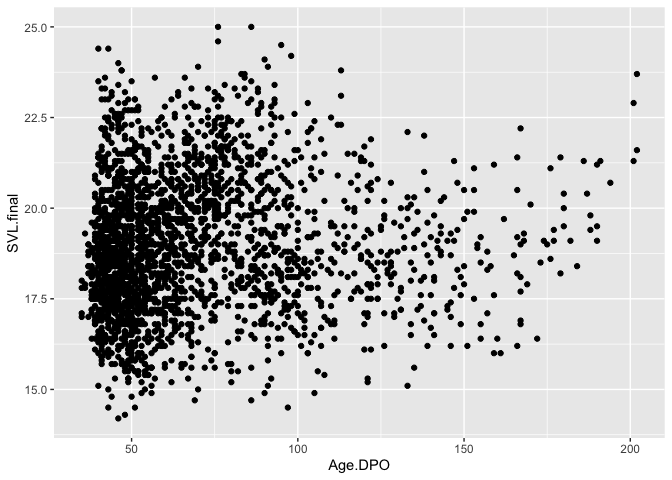
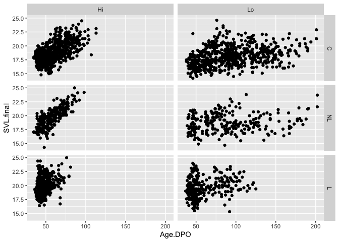
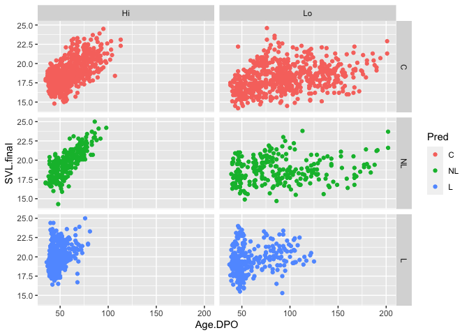
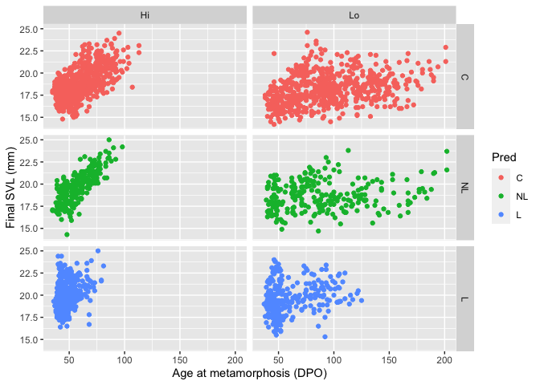
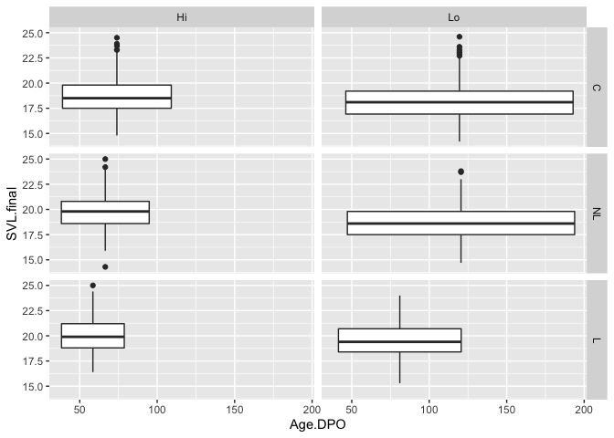
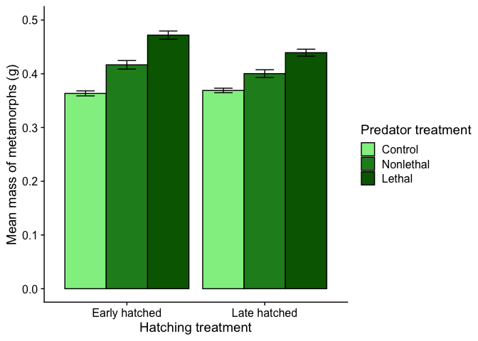

Chapter 4 answers
================
Justin Touchon
7/21/2021

This page provides sample answers to the assignment at the end of
Chapter 4 of Applied Statistics with R: A Practical Guide for the Life
Sciences by Justin Touchon. Chapter 4 focuses on *Plotting*. It’s really
about starting to understand how you go about making really nice
looking, professional visualizations of your data. You learned a little
about how to use colors and how to use the package ***ggplot2*** to
create different types of plots: scatterplots, histograms, density
plots, box-and-whisker plots, violin plots, even bar graphs. We saw how
to *facet* our plots to more fully explore our data. At the end of the
chapter, we really walked though how to build a custom figure
step-by-step.

There are two assignments to do to continue working on the skills you
are building. As always, my hope is that you are here either because 1)
you want to check the answers you got to make sure you completed the
assignments correctly, or 2) you got stumped and need some help. Either
way, you will learn much more if you have already spent some time
working through the assignments on your own. If you haven’t done that,
close this page and go work on it! :) The assignments at the end of
Chapter 4 are particularly open ended, so these answers are truly meant
to be *examples* and are not the only answers you can get. That said, I
will try to explain the answer in a way that is helpful no matter how
you might have chosen to answer the questions.

<span style="color: #009933;">

# Assignment 1

**Use** qplot() **to make a 2x3 faceted plot of age at metamorphosis
against final metamorph SVL, adding informative axes labels (hint: the
“ylab=” argument also works in** qplot())**.**

</span>

Okay, this one is not that open-ended. There is really one main way to
do this. First, let’s make sure we have the packages and data loaded in.

``` r
library(tidyverse)
```

``` r
RxP.clean<-read.csv("RxP_clean.csv", stringsAsFactors = T)
RxP.clean$Pred<-factor(RxP.clean$Pred, levels=c("C","NL","L"))
```

As always, let’s look at the structure to make sure everything looks
good.

``` r
str(RxP.clean)
```

    ## 'data.frame':    2493 obs. of  14 variables:
    ##  $ Ind              : int  1 2 3 4 5 6 7 8 9 10 ...
    ##  $ Block            : int  5 5 5 5 5 5 5 2 2 1 ...
    ##  $ Tank             : int  7 4 4 7 10 4 4 5 4 1 ...
    ##  $ Tank.Unique      : int  55 52 52 55 58 52 52 17 16 1 ...
    ##  $ Hatch            : Factor w/ 2 levels "E","L": 1 2 2 1 2 2 2 1 2 2 ...
    ##  $ Pred             : Factor w/ 3 levels "C","NL","L": 2 1 1 2 3 1 1 3 1 2 ...
    ##  $ Res              : Factor w/ 2 levels "Hi","Lo": 1 1 1 1 1 1 1 1 1 1 ...
    ##  $ Age.DPO          : int  35 35 35 35 36 36 36 39 39 39 ...
    ##  $ Age.FromEmergence: int  1 1 1 1 2 2 2 5 5 5 ...
    ##  $ SVL.initial      : num  18 17.7 18.1 16.8 18.7 17.5 17.3 19.6 16.5 17.5 ...
    ##  $ Tail.initial     : num  5.4 1.1 5 6.4 6.3 4.4 1.3 1.5 2 5.1 ...
    ##  $ SVL.final        : num  17 18 17.8 17.1 19.3 17.8 17.9 19.6 17.7 19.5 ...
    ##  $ Mass.final       : num  0.38 0.35 0.41 0.3 0.46 0.3 0.42 0.5 0.33 0.46 ...
    ##  $ Resorb.days      : int  3 3 3 3 3 4 2 2 2 3 ...

So we want to examine how age at metamorphosis varies with final SVL at
metamorphosis. The assignment didn’t specify what type of plot to make,
but hopefully it should be obvious. Since both variables are continuous,
we are making a scatterplot. In it’s simplest form, we can use
**qplot()** to make a simple plot, like this.

``` r
qplot(data=RxP.clean, x=Age.DPO, y=SVL.final, geom="point")
```

<!-- -->

Now, that is a fairly boring figure that doesn’t really show us that
much. Of course, the assignment said to facet the figure into a 2x3
panel, and to add descriptive labels and such. Let’s also add some
color, shall we?

First, we can facet the plot by two variables, such as *Pred* and *Res*.
All we have to do is add one more argument to our code from above.

``` r
qplot(data=RxP.clean, x=Age.DPO, y=SVL.final, geom="point", facets=Pred~Res)
```

<!-- -->

This looks better, but let’s add some color just for fun. I’m going to
color the figure based on the Predator treatment.

``` r
qplot(data=RxP.clean, x=Age.DPO, y=SVL.final, geom="point", facets=Pred~Res, col=Pred)
```

<!-- -->

That’s better! Let’s add some better axis labels. Since we are using
**qplot()**, we can simply alter our axis labels with the *xlab=* and
*ylab=* arguments. Simply type the words you want for the label in
quotes.

``` r
qplot(data=RxP.clean, x=Age.DPO, y=SVL.final, geom="point", facets=Pred~Res, col=Pred, xlab="Age at metamorphosis (DPO)", ylab="Final SVL (mm)")
```

<!-- -->

We could do more of course, but this is a pretty good looking figure for
a single line of code!

Now, maybe you came here to check your answer and found out that you
didn’t do exactly what I did, but you still made a figure. How is that
possible? For example, what if you had defined your *geom* as a boxplot?
R would have still made a figure, but what exactly did it show you?

``` r
qplot(data=RxP.clean, x=Age.DPO, y=SVL.final, geom="boxplot", facets=Pred~Res)
```

    ## Warning: Continuous x aesthetic -- did you forget aes(group=...)?

<!-- -->

If you tell ***ggplot2*** to make a boxplot, but give it two continuous
variables, it will make a boxplot and plot the box at the mean value of
the x-variable (since there are no categories, which is where it would
normally put the box). The width of each box is 90% of the total range
of the data for that set of variables. Thus, this isn’t a particular
useful visualization, but maybe in another context it might be. At least
you know what is happening now!

<span style="color: #009933;">

# Assignment 2

**Make a barplot like the previous one (at the end of Chapter 4), but
instead of using the initial SVL data, make it from a) the final
metamorph mass data and b) have it grouped by predator treatment and
hatching age. Make sure it has correct error bars and give it some
creative colors! Before you start coding away, think about what existing
code you have in your script file that you can modify to make this
figure.**

</span>

As is hinted at in the description of the assignment, this is where
existing code will make your life much easier. In working through
Chapter 4, you should have developed the following code to make the bar
graph of mean SVL at metamorphosis. I won’t execute it here, since we’ve
already covered this.

``` r
library(cowplot)
RP.means<-RxP.clean %>% #Define what dataset we are using
      group_by(Res, Pred) %>% #Set the groups
      summarize(SVL.mean = mean(SVL.initial), #Calculate the mean,
                SVL.sd = sd(SVL.initial), #Calculate the SD
                SVL.n = length(SVL.initial)) %>%  #Calculate the N
      mutate(SVL.se = SVL.sd/sqrt(SVL.n)) #Calculate the SE
ggplot(data=RP.means, aes(x=Res, y=SVL.mean, fill=Pred))+
    geom_col(position="dodge", col="black")+
  coord_cartesian(ylim=c(15,20))+
  scale_fill_manual(values = c("light green",
                               "forest green",
                               "dark green"),
                    name="Predator treatment",
                    labels=c("Control",
                             "Nonlethal",
                             "Lethal"))+ #Custom legend!
  geom_errorbar(aes(ymin=SVL.mean-SVL.se, ymax=SVL.mean+SVL.se), 
                position=position_dodge(0.9), width=0.4)+
  labs(y="Mean SVL of metamorphs (mm)")+#Custom y-axis label
  scale_x_discrete(name="Resource treatment",
                   labels=c("High resource diet",
                            "Low resource diet"))+ #Custom x-axis
  theme_cowplot() #Make it look great with cowplot!
```

So, how can we take this code and modify it to make a new figure? Well,
it starts back when we create the summarized data in *RP.means*.
Originally, we grouped the data by *Pred* and *Res* and calculated the
means, standard deviations, and then standard errors from the
*SVL.initial* variable. All we have to do is modify that code with new
data and new grouping variables. I’m going to call this new object
*RP.means2* to avoid confusion.

``` r
RP.means2<-RxP.clean %>% #Define what dataset we are using
      group_by(Hatch, Pred) %>% #Set the groups
      summarize(Mass.mean = mean(Mass.final), #Calculate the mean,
                Mass.sd = sd(Mass.final), #Calculate the SD
                Mass.n = length(Mass.final)) %>%  #Calculate the N
      mutate(Mass.se = Mass.sd/sqrt(Mass.n)) #Calculate the SE
```

    ## `summarise()` has grouped output by 'Hatch'. You can override using the `.groups` argument.

``` r
RP.means2
```

    ## # A tibble: 6 x 6
    ## # Groups:   Hatch [2]
    ##   Hatch Pred  Mass.mean Mass.sd Mass.n Mass.se
    ##   <fct> <fct>     <dbl>   <dbl>  <int>   <dbl>
    ## 1 E     C         0.363   0.116    627 0.00465
    ## 2 E     NL        0.417   0.118    219 0.00799
    ## 3 E     L         0.472   0.134    306 0.00765
    ## 4 L     C         0.369   0.109    678 0.00420
    ## 5 L     NL        0.400   0.120    275 0.00723
    ## 6 L     L         0.439   0.127    388 0.00645

Now that we have a set of data to plot, we just modify our code with the
next data. You’ll have to modify the names of the various aesthetics
throughout the code, changing *x=Res* to *x=Hatch*, or *y=SVL.mean* to
*y=Mass.mean* for example. You’ll also need to change the y-axis limits,
since the scale for Mass and SVL are wildly different.

``` r
ggplot(data=RP.means2, aes(x=Hatch, y=Mass.mean, fill=Pred))+
    geom_col(position="dodge", col="black")+
  coord_cartesian(ylim=c(0,0.5))+
  scale_fill_manual(values = c("light green",
                               "forest green",
                               "dark green"),
                    name="Predator treatment",
                    labels=c("Control",
                             "Nonlethal",
                             "Lethal"))+ #Custom legend!
  geom_errorbar(aes(ymin=Mass.mean-Mass.se, ymax=Mass.mean+Mass.se), 
                position=position_dodge(0.9), width=0.4)+
  labs(y="Mean mass of metamorphs (g)")+#Custom y-axis label
  scale_x_discrete(name="Hatching treatment",
                   labels=c("Early hatched",
                            "Late hatched"))+ #Custom x-axis
  theme_cowplot() #Make it look great with cowplot!
```

<!-- -->
