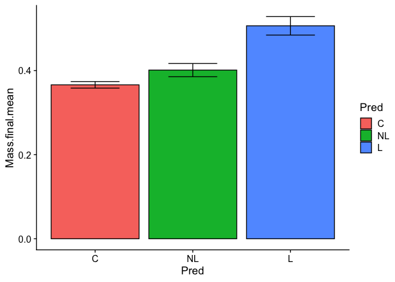
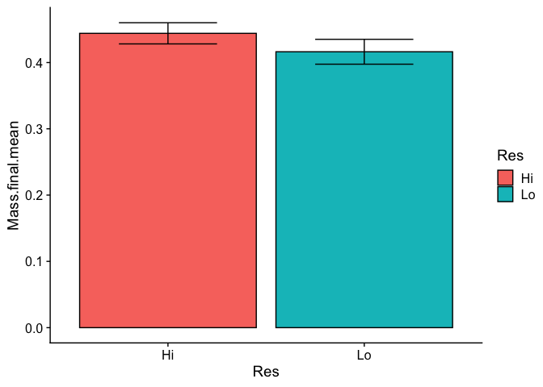
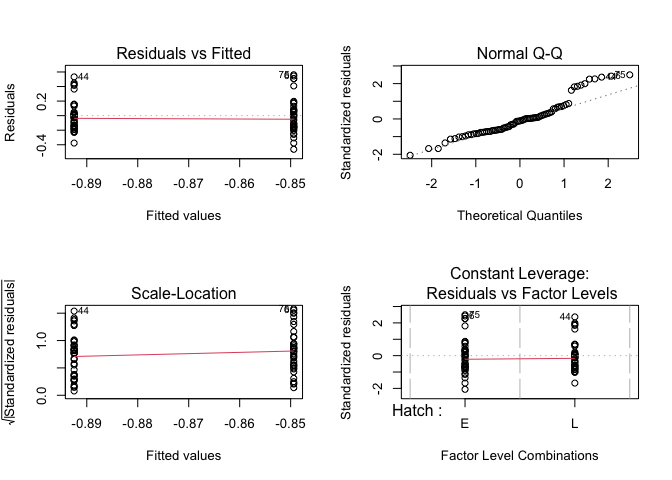
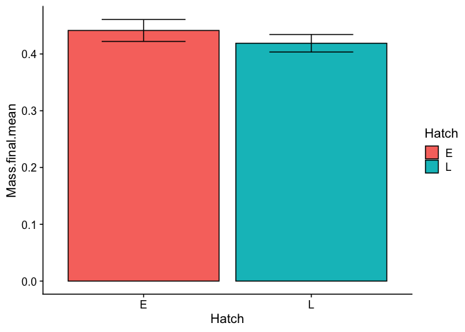
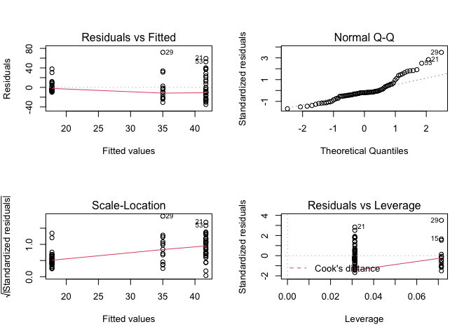

Chapter 5 answers
================
Justin Touchon
7/21/2021

This page provides sample answers to the assignment at the end of
Chapter 5 of Applied Statistics with R: A Practical Guide for the Life
Sciences by Justin Touchon. Chapter 4 introduces you to *Linear Models*
for the first time. Sure, we looked at a few non-parametric tests and
even Student’s t-test, but really the point of the chapter is learning
how to conduct a one-way ANOVA. We also continued practicing using
**qplot()** and other functions in the ***tidyverse*** to explore our
data.

There are two assignments to do to continue working on the skills you
are building. As always, my hope is that you are here either because 1)
you want to check the answers you got to make sure you completed the
assignments correctly, or 2) you got stumped and need some help. Either
way, you will learn much more if you have already spent some time
working through the assignments on your own. If you haven’t done that,
close this page and go work on it! :) The assignments at the end of
Chapter 5 are less open ended so if you did the assignments correctly
you should get the same values I have here.

<span style="color: #009933;">

# Question 1

**Go back and conduct a series of one-way ANOVAs, analyzing the final
Mass of metamorphs by each of the three predictors in the dataset —
Hatching age, Predator treatment, and Resource level.**

-   Make sure you check the final mass data for normality.  
-   Make sure you check the diagnostic plots to see if things look okay
    or really out of whack (if the model really doesn’t fit well, it
    should be obvious).  
-   Use what you learned in chapter 4 to make a bar graph to go with the
    analysis of each individual predictor.  
-   For the analysis of Predator treatment, conduct a post-hoc Tukey
    test to find out which of the three treatments are different from
    one another.

</span>

First, we should load any packages we will need.

``` r
library(MASS)
library(car)
library(emmeans)
library(cowplot)
library(tidyverse)
```

Next, read in the data and make the summarized byTank version. You might
already have this loaded in the workspace if you’ve just finished
working through Chapter 5.

    ## 'data.frame':    78 obs. of  15 variables:
    ##  $ Tank.Unique          : int  1 2 3 4 5 6 7 8 9 10 ...
    ##  $ Block                : int  1 1 1 1 1 1 1 1 1 1 ...
    ##  $ Pred                 : Factor w/ 3 levels "C","NL","L": 2 1 1 3 2 3 2 1 3 1 ...
    ##  $ Hatch                : Factor w/ 2 levels "E","L": 2 1 2 2 1 1 2 1 2 2 ...
    ##  $ Res                  : Factor w/ 2 levels "Hi","Lo": 1 1 1 2 1 1 2 2 1 2 ...
    ##  $ Age.DPO              : num  47.2 45.4 53.8 56.9 64.8 ...
    ##  $ Age.FromEmergence    : num  13.2 11.4 19.8 22.9 30.8 ...
    ##  $ SVL.initial          : num  19.4 18.4 18.9 18.8 19.7 ...
    ##  $ Tail.initial         : num  4.83 5.37 4.8 4.63 5.43 ...
    ##  $ SVL.final            : num  19.7 19 19.1 19.1 20.1 ...
    ##  $ Mass.final           : num  0.418 0.382 0.412 0.382 0.486 ...
    ##  $ Resorb.days          : num  3.49 3.79 3.51 3.65 4.22 ...
    ##  $ log.SVL.final        : num  2.98 2.94 2.95 2.95 3 ...
    ##  $ log.Age.FromEmergence: num  2.58 2.43 2.99 3.13 3.43 ...
    ##  $ log.Age.DPO          : num  3.85 3.82 3.99 4.04 4.17 ...

## First, let’s check the distribution

In Chapter 5 you learned all about the “normal” distribution. Let’s
check the best distribution to use for the final mass data. We will
first examine histograms of the raw and log-transformed data, then test
the distributions using **fitdistr()** from the ***MASS*** package.

``` r
plot1<-qplot(data=RxP.byTank, x=Mass.final, geom="histogram")
plot2<-qplot(data=RxP.byTank, x=log(Mass.final), geom="histogram")
plot_grid(plot1,plot2)
```

<!-- -->

Log transformation appears to help a bit, at least graphically. Let’s
see what **fitdistr()** says.

``` r
fit1<-fitdistr(RxP.byTank$Mass.final, "normal")
fit2<-fitdistr(RxP.byTank$Mass.final, "lognormal")
AIC(fit1,fit2)
```

    ##      df       AIC
    ## fit1  2 -121.4908
    ## fit2  2 -142.5378

Indeed, log-transformation helps improve the normality of the data. Now,
let’s hard code a log-transformed version of the data.

``` r
RxP.byTank$log.Mass.final<-log(RxP.byTank$Mass.final)
```

Now we are ready to do some analyses!

## Examine the effect of Predator treatment

We can start off by making a linear model — in this case a one-way
Analysis of Variance, or ANOVA — to look at how well Predator treatment
explains the variance in final metamorph mass. Let’s create the model
then examine the diagnostic plots. In the code below, I show you a litle
trick for changing the graphics parameters so you can see all 4 plots at
once!

``` r
lm1<-lm(log.Mass.final~Pred, data=RxP.byTank)
par(mfrow=c(2,2))#This will put the 4 plots in a 2x2 grid
plot(lm1)
```

<!-- -->

The diagnostic plots look pretty good. Now let’s use the **Anova()**
function from the ***car*** package to assess significance. Also, since
there are three levels to the Pred variable (Control, Nonlethal, and
Lethal) we should conduct a Tukey post-hoc test to see which treatments
differ from one another. There are several packages you can use, but I
prefer ***emmeans***.

``` r
Anova(lm1)
```

    ## Anova Table (Type II tests)
    ## 
    ## Response: log.Mass.final
    ##           Sum Sq Df F value    Pr(>F)    
    ## Pred      1.5259  2   23.29 1.357e-08 ***
    ## Residuals 2.4570 75                      
    ## ---
    ## Signif. codes:  0 '***' 0.001 '**' 0.01 '*' 0.05 '.' 0.1 ' ' 1

``` r
pairs(emmeans(lm1, specs="Pred"))
```

    ##  contrast estimate     SE df t.ratio p.value
    ##  C - NL    -0.0879 0.0580 75 -1.516  0.2891 
    ##  C - L     -0.3040 0.0452 75 -6.719  <.0001 
    ##  NL - L    -0.2161 0.0580 75 -3.726  0.0011 
    ## 
    ## P value adjustment: tukey method for comparing a family of 3 estimates

We can see that we have a very significant effect of the predator
treatment. Specifically, the final mass of froglets from the Lethal
predator treatment is different from that seen in both the Control and
Nonlethal predator treatments, which did not differ from one another. We
can easily visualize these differences with a bargraph. This is
essentially doing the same thing as we did in Chapter 4. We need to
summarize the data to calculate the means and standard errors for our
three groups, then pipe that to **ggplot()** to visualize it.

``` r
RxP.byTank %>%
  group_by(Pred)%>%
  summarize(Mass.final.mean = mean(Mass.final),
            Mass.final.sd = sd(Mass.final),
            Mass.final.N = length(Mass.final))%>%
  mutate(Mass.final.se = Mass.final.sd/sqrt(Mass.final.N))%>%
  ggplot(data=., aes(x=Pred, y=Mass.final.mean, fill=Pred))+
  geom_col(col="black")+
  geom_errorbar(aes(ymin=Mass.final.mean-Mass.final.se, 
                    ymax=Mass.final.mean+Mass.final.se), 
                width=0.5)+
  theme_cowplot()
```

<!-- -->

## Now, explore the effect of Resource treatment

Here, we are going to do the same exact thing as above. We are going to
1) make a linear model, 2) assess the diagnostic plots, 3) assess
significance with **Anova()**, and 4) plot it. The only difference,
which you will see below, is that since our predictor (Res) has only two
levels to it, we could also analyze the data with a t-test. For you
typing along at home, the easiest thing to do here is copy and paste all
the code you have typed for the Predator treatment and just modify it
for the Resource treatment.

``` r
lm2<-lm(log.Mass.final~Res, data=RxP.byTank)
par(mfrow=c(2,2))
plot(lm2)
```

<!-- -->

The diagnostic plots once again look pretty good.

``` r
Anova(lm2)
```

    ## Anova Table (Type II tests)
    ## 
    ## Response: log.Mass.final
    ##           Sum Sq Df F value Pr(>F)
    ## Res       0.1091  1  2.1401 0.1476
    ## Residuals 3.8739 76

There is no significant effect of resource treatment on final mass at
metamorphosis. Since there are only two categories in the resource
treatment, we could have also done this with a t-test.

``` r
t.test(log.Mass.final~Res, data=RxP.byTank)
```

    ## 
    ##  Welch Two Sample t-test
    ## 
    ## data:  log.Mass.final by Res
    ## t = 1.4629, df = 73.786, p-value = 0.1477
    ## alternative hypothesis: true difference in means between group Hi and group Lo is not equal to 0
    ## 95 percent confidence interval:
    ##  -0.0270832  0.1766708
    ## sample estimates:
    ## mean in group Hi mean in group Lo 
    ##       -0.8335416       -0.9083354

Now let’s plot it!

``` r
RxP.byTank %>%
  group_by(Res)%>%
  summarize(Mass.final.mean = mean(Mass.final),
            Mass.final.sd = sd(Mass.final),
            Mass.final.N = length(Mass.final))%>%
  mutate(Mass.final.se = Mass.final.sd/sqrt(Mass.final.N))%>%
  ggplot(data=., aes(x=Res, y=Mass.final.mean, fill=Res))+
  geom_col(col="black")+
  geom_errorbar(aes(ymin=Mass.final.mean-Mass.final.se, 
                    ymax=Mass.final.mean+Mass.final.se), 
                width=0.5)+
  theme_cowplot()
```

<!-- -->

## Lastly, the hatching age treatment

Same story, different variable…

``` r
lm3<-lm(log.Mass.final~Hatch, data=RxP.byTank)
par(mfrow=c(2,2))
plot(lm3)
```

<!-- -->

The diagnostic plots look pretty good.

``` r
Anova(lm3)
```

    ## Anova Table (Type II tests)
    ## 
    ## Response: log.Mass.final
    ##           Sum Sq Df F value Pr(>F)
    ## Hatch     0.0362  1  0.6973 0.4063
    ## Residuals 3.9467 76

There is even less of an effect of hatching age on final mass! Once
again, we could have done this as a t-test.

``` r
t.test(log.Mass.final~Hatch, data=RxP.byTank)
```

    ## 
    ##  Welch Two Sample t-test
    ## 
    ## data:  log.Mass.final by Hatch
    ## t = 0.83502, df = 73.754, p-value = 0.4064
    ## alternative hypothesis: true difference in means between group E and group L is not equal to 0
    ## 95 percent confidence interval:
    ##  -0.05974027  0.14592285
    ## sample estimates:
    ## mean in group E mean in group L 
    ##      -0.8493928      -0.8924841

Let’s plot these data which don’t differ between groups!

``` r
RxP.byTank %>%
  group_by(Hatch)%>%
  summarize(Mass.final.mean = mean(Mass.final),
            Mass.final.sd = sd(Mass.final),
            Mass.final.N = length(Mass.final))%>%
  mutate(Mass.final.se = Mass.final.sd/sqrt(Mass.final.N))%>%
  ggplot(data=., aes(x=Hatch, y=Mass.final.mean, fill=Hatch))+
  geom_col(col="black")+
  geom_errorbar(aes(ymin=Mass.final.mean-Mass.final.se, 
                    ymax=Mass.final.mean+Mass.final.se), 
                width=0.5)+
  theme_cowplot()
```

<!-- -->

## Summary

It appears that lethal predators had a very strong effect on the final
mass of red-eyed treefrogs going through metamorphosis, but resources
and hatching age by themselves had pretty minimal effects.

<span style="color: #009933;">

# Question 2

**What would have happened if we had not log-transformed the
Age.FromEmergence data? Would we have gotten the same results? What does
the Q-Q plot look like?**

</span>

In Chapter 5, we examined the effects of resources and predators on the
age at emergence from the water. The data very clearly needed to be
log-transformed, but what if we hadn’t done that? As a refresher, here
is the model we initially ran.

``` r
lm4<-lm(log.Age.FromEmergence~Pred, data=RxP.byTank)
par(mfrow=c(2,2))
plot(lm4)
```

<!-- -->

``` r
Anova(lm4)
```

    ## Anova Table (Type II tests)
    ## 
    ## Response: log.Age.FromEmergence
    ##           Sum Sq Df F value    Pr(>F)    
    ## Pred       9.710  2  12.389 2.244e-05 ***
    ## Residuals 29.392 75                      
    ## ---
    ## Signif. codes:  0 '***' 0.001 '**' 0.01 '*' 0.05 '.' 0.1 ' ' 1

``` r
pairs(emmeans(lm4, specs="Pred"))
```

    ##  contrast estimate    SE df t.ratio p.value
    ##  C - NL      0.268 0.201 75 1.335   0.3806 
    ##  C - L       0.773 0.157 75 4.936   <.0001 
    ##  NL - L      0.505 0.201 75 2.516   0.0368 
    ## 
    ## P value adjustment: tukey method for comparing a family of 3 estimates

Okay, so we see a very strong effect of the predator treatment,
primarily being driven by the Lethal predator treatment which differed
from both the Control and Non-lethal treatments. How does it differ if
the data are not log-transformed?

``` r
lm4<-lm(Age.FromEmergence~Pred, data=RxP.byTank)
par(mfrow=c(2,2))
plot(lm4)
```

<!-- -->

``` r
Anova(lm4)
```

    ## Anova Table (Type II tests)
    ## 
    ## Response: Age.FromEmergence
    ##           Sum Sq Df F value    Pr(>F)    
    ## Pred        9467  2  10.442 9.986e-05 ***
    ## Residuals  33999 75                      
    ## ---
    ## Signif. codes:  0 '***' 0.001 '**' 0.01 '*' 0.05 '.' 0.1 ' ' 1

``` r
pairs(emmeans(lm4, specs="Pred"))
```

    ##  contrast estimate   SE df t.ratio p.value
    ##  C - NL       6.69 6.82 75 0.980   0.5918 
    ##  C - L       23.91 5.32 75 4.492   0.0001 
    ##  NL - L      17.23 6.82 75 2.525   0.0361 
    ## 
    ## P value adjustment: tukey method for comparing a family of 3 estimates

Perhaps surprisingly, we get essentially the same answer. The Q-Q plot
is definitely worse, but the results of our statistical model are almost
exactly the same. How interesting, right?

The take-home point is that you need to check your data and you should
go with the model that fits the best. Sometimes it makes a big
difference, and sometimes it might not. In this case, the effect of
predators is so strong that it can be detected whether the data are
log-transformed or not. No matter what, in this instance you would want
to log-transform the data because it clearly makes the model fit better.
We will see examples of how data transformation and choice of error
distribution can really effect your results in Chapter 7.
