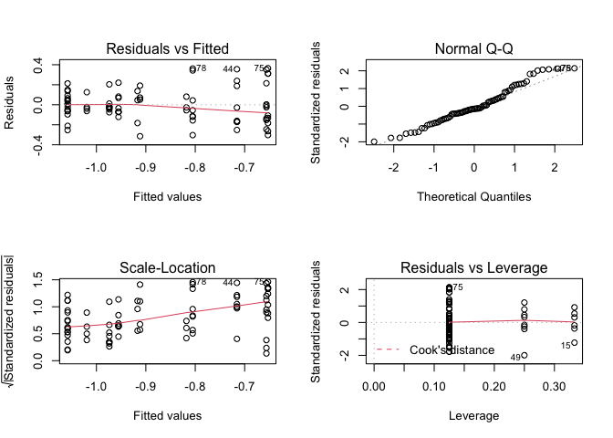
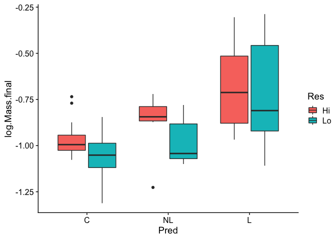
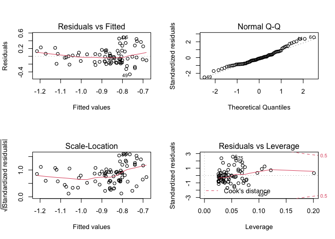
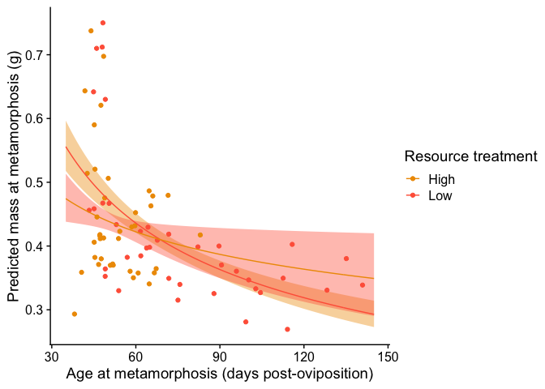
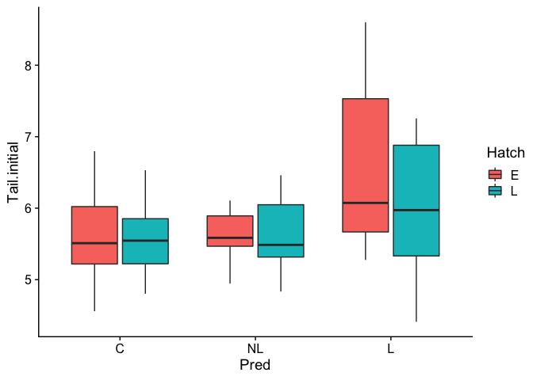
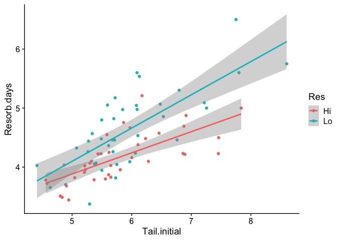
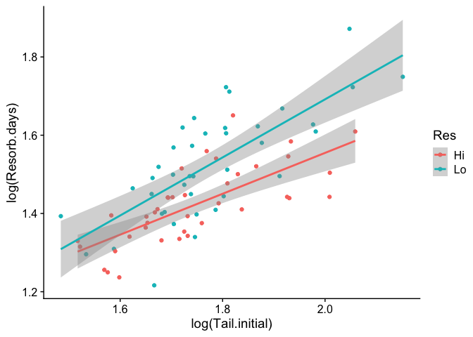

Chapter 6 answers
================
Justin Touchon
7/22/2021

This page provides sample answers to the assignment at the end of
Chapter 6 of Applied Statistics with R: A Practical Guide for the Life
Sciences by Justin Touchon. Chapter 6 introduces you to *More Linear
Models*, which is to say models like *linear regression*, *two-way
ANOVA*, and *Analysis of Covariance*. We also continued practicing using
the ***tidyverse*** to explore and manipulate our data. We saw how to do
fun things like plot confidence intervals around non-linear regression
lines and how to use the **predict()** function. There was **a lot** in
this chapter.

There are three assignments to do to continue working on the skills you
are building. As always, my hope is that you are here either because 1)
you want to check the answers you got to make sure you completed the
assignments correctly, or 2) you got stumped and need some help. Either
way, you will learn much more if you have already spent some time
working through the assignments on your own. If you haven’t done that,
close this page and go work on it! :) The first assignment at the end of
Chapter 6 is straightforward, but the second and third are very open
ended. I have tried to reasonably show some different options for what
you might have come up with, but understand that your choices might have
been different that what I show here.

<span style="color: #009933;">

# Question 1

**At the end of the Chapter 5, you analyzed the log of final mass by
each of the three categorical predictors independently. What happens if
you include all three predictors in the model at the same time? Does the
significance of any of the individual predictors change when you include
more variables? If so, what does that tell you about how your
interpretation of one variable might change when you include other
variables in the model?**

</span>

As I did in Chapter 5, I’m going to load any packages I will need and
create the “byTank” version of the data.

``` r
library(MASS)
library(car)
library(emmeans)
library(cowplot)
library(tidyverse)
```

    ## 'data.frame':    78 obs. of  16 variables:
    ##  $ Tank.Unique          : int  1 2 3 4 5 6 7 8 9 10 ...
    ##  $ Block                : int  1 1 1 1 1 1 1 1 1 1 ...
    ##  $ Pred                 : Factor w/ 3 levels "C","NL","L": 2 1 1 3 2 3 2 1 3 1 ...
    ##  $ Hatch                : Factor w/ 2 levels "E","L": 2 1 2 2 1 1 2 1 2 2 ...
    ##  $ Res                  : Factor w/ 2 levels "Hi","Lo": 1 1 1 2 1 1 2 2 1 2 ...
    ##  $ Age.DPO              : num  47.2 45.4 53.8 56.9 64.8 ...
    ##  $ Age.FromEmergence    : num  13.2 11.4 19.8 22.9 30.8 ...
    ##  $ SVL.initial          : num  19.4 18.4 18.9 18.8 19.7 ...
    ##  $ Tail.initial         : num  4.83 5.37 4.8 4.63 5.43 ...
    ##  $ SVL.final            : num  19.7 19 19.1 19.1 20.1 ...
    ##  $ Mass.final           : num  0.418 0.382 0.412 0.382 0.486 ...
    ##  $ Resorb.days          : num  3.49 3.79 3.51 3.65 4.22 ...
    ##  $ log.SVL.final        : num  2.98 2.94 2.95 2.95 3 ...
    ##  $ log.Age.FromEmergence: num  2.58 2.43 2.99 3.13 3.43 ...
    ##  $ log.Age.DPO          : num  3.85 3.82 3.99 4.04 4.17 ...
    ##  $ log.Mass.final       : num  -0.873 -0.962 -0.887 -0.962 -0.721 ...

The model we need to create is hopefully straightforward to you. Instead
of having just one predictor, such as *Pred* or *Res*, we will have all
three of our predictors: Pred, Hatch, and Res. We will then use the
**Anova()** function from the ***car*** package to assess statistical
significance.

Before we make the model, recall that when we analyzed the variables
individually there was a highly significant effect of predators, but no
significant effect of resources or hatching age. What will happen when
all three predictors are in the model together?

``` r
lm.PHR<-lm(log.Mass.final~Pred*Hatch*Res, data=RxP.byTank)
par(mfrow=c(2,2));plot(lm.PHR)
```

<!-- -->

Notice that the QQ-plot looks particularly great now that we have more
predictors in the model!

``` r
Anova(lm.PHR)
```

    ## Anova Table (Type II tests)
    ## 
    ## Response: log.Mass.final
    ##                 Sum Sq Df F value   Pr(>F)    
    ## Pred           1.52168  2 22.9030 2.79e-08 ***
    ## Hatch          0.03198  1  0.9628  0.33006    
    ## Res            0.10805  1  3.2527  0.07587 .  
    ## Pred:Hatch     0.05866  2  0.8829  0.41843    
    ## Pred:Res       0.01362  2  0.2051  0.81511    
    ## Hatch:Res      0.03142  1  0.9457  0.33437    
    ## Pred:Hatch:Res 0.01953  2  0.2939  0.74629    
    ## Residuals      2.19252 66                     
    ## ---
    ## Signif. codes:  0 '***' 0.001 '**' 0.01 '*' 0.05 '.' 0.1 ' ' 1

So this is really interesting. Now that we have more predictors in the
model, the estimate of statistical significance for our Resource
treatment has gone from 0.14 when it was analyzed alone to 0.076. It’s
not below the generally accepted threshold of 0.05, but it is close
enough that I think you could argue that *something* is going on.
Resources are not having as big of an effect as predators, but they are
clearly have some impact on final mass at metamorphosis. We can see this
effect if we create a box-and-whisker plot of the data.

``` r
qplot(data=RxP.byTank, x=Pred, y=log.Mass.final, fill=Res, geom="boxplot")+theme_cowplot()
```

<!-- -->

This clearly shows us that metamorphs emerging from the High resource
treatment were generally larger than those emerging from the Low
resource treatment, and that this effect is pretty consistent across the
three predator treatments (although it is less pronounced in the Lethal
predator treatment).

<span style="color: #009933;">

# Question 2

**Combine your knowledge of** predict() **and** ggplot() **to plot an
ANCOVA different than that represented by lm5. Make sure it is plotted
on the original scale of whatever variables you choose and that it has
confidence intervals. Make sure to add interesting colors and useful
axes, etc.**

</span>

Okay, this is a very open ended question. You can pick whichever
variables you want! As a reminder, the lm5 was a model that evaluated
the effect of Predators on final SVL while controlling for variation in
age at metamorphosis. This is known as an Analysis of Covariance, or
ANCOVA for short.

``` r
lm5<-lm(log.SVL.final~log.Age.DPO*Pred, data=RxP.byTank)
```

The assignment has two steps.

1.  You need to pick a pair of continuous variables, one to use as a
    response variable and one to use as your covariate, and one
    categorical variable. Now, you can’t just pick any pair of
    continuous variables. You need to make sure that the pair make sense
    together. For example, it would not make much sense to use SVL as a
    covariate for age at metamorphosis, since we would generally expect
    the relationship to go in the other direction (age should effect
    size, but size would not effect age).

2.  You use **predict()** to plot it, like we did while working through
    the chapter.

I will provide one examples of a possible answer you might get and
hopefully that will illuminate how to think about making a figure like
this.

## The effect of resources on final mass at metamorphosis, controlling for variation in age at metamorphosis

Perhaps the simplest thing you could do is just to change the response
variable. Instead of looking at snout-vent length, let’s examine mass.
But, to make the example a little more interesting let’s use *Res* as
our categorical variable instead of *Pred*. The model would look like
this. Recall that it is good practice to have your covariate coded
before the categorical variable.

``` r
lm.Age_Res<-lm(log.Mass.final~log.Age.DPO*Res, data=RxP.byTank)
```

Let’s look at the diagnostic plots to make sure everything looks okay.

``` r
par(mfrow=c(2,2));plot(lm.Age_Res)
```

<!-- -->

Overall these look great. Next, let’s look at the summary of the model
and assess significance.

``` r
summary(lm.Age_Res)
```

    ## 
    ## Call:
    ## lm(formula = log.Mass.final ~ log.Age.DPO * Res, data = RxP.byTank)
    ## 
    ## Residuals:
    ##      Min       1Q   Median       3Q      Max 
    ## -0.46215 -0.14395 -0.02316  0.10666  0.49077 
    ## 
    ## Coefficients:
    ##                   Estimate Std. Error t value Pr(>|t|)
    ## (Intercept)        0.02029    0.71186   0.029    0.977
    ## log.Age.DPO       -0.21551    0.17950  -1.201    0.234
    ## ResLo              0.99534    0.80811   1.232    0.222
    ## log.Age.DPO:ResLo -0.23531    0.20050  -1.174    0.244
    ## 
    ## Residual standard error: 0.1959 on 74 degrees of freedom
    ## Multiple R-squared:  0.2868, Adjusted R-squared:  0.2579 
    ## F-statistic: 9.918 on 3 and 74 DF,  p-value: 1.421e-05

``` r
Anova(lm.Age_Res)
```

    ## Anova Table (Type II tests)
    ## 
    ## Response: log.Mass.final
    ##                  Sum Sq Df F value    Pr(>F)    
    ## log.Age.DPO     0.98025  1 25.5352 3.037e-06 ***
    ## Res             0.03562  1  0.9279    0.3385    
    ## log.Age.DPO:Res 0.05287  1  1.3773    0.2443    
    ## Residuals       2.84073 74                      
    ## ---
    ## Signif. codes:  0 '***' 0.001 '**' 0.01 '*' 0.05 '.' 0.1 ' ' 1

This is really interesting. First, the summary output shows us that our
adjusted R<sup>2</sup> is quite high, 0.2579. That tells us that our
predictors collectively explain 25.79% of the variation in metamorph
mass. That’s not bad, but not nearly as high as when we included *Pred*
in the model. Our model as a whole is also highly significant, with a
p-value of 0.00001421. We could of course use the model coefficients
(under the *Estimate* column) to figure out the intercepts and slopes
for the regressions for each resource level, but we are going to use
predict to do that for us. Let’s do that, shall we?

First, let’s figure out what the range should be for our x-variable.
Recall that, as we did in Chapter 6, we can log-transform the values
directly in next step where we create our blank data frame, so we want
to know the range of the *raw* data values here.

``` r
range(RxP.byTank$Age.DPO)
```

    ## [1]  38.11111 140.90244

Okay, so the smallest average age at metamorphosis was 38.1 days and the
largest was 140.9 days. We’ll thus declare our x-axis range as 35–145
days (no harm in putting a little buffer around the data, right?). Next
we need to make our “newdata” object for predict to use. We can use
**expand.grid()** to make our lives easier.

``` r
lm.Age_Res.newdata<-expand.grid("log.Age.DPO"=log(35:145), Res=c("Lo","Hi"))
```

Next, use **predict()** to calculate the predicted values and their
confidence intervals.

``` r
lm.Age_Res.predicted<-predict(lm.Age_Res, newdata=lm.Age_Res.newdata, se.fit=T)
str(lm.Age_Res.predicted)
```

    ## List of 4
    ##  $ fit           : Named num [1:222] -0.587 -0.6 -0.612 -0.624 -0.636 ...
    ##   ..- attr(*, "names")= chr [1:222] "1" "2" "3" "4" ...
    ##  $ se.fit        : Named num [1:222] 0.0709 0.0687 0.0665 0.0644 0.0624 ...
    ##   ..- attr(*, "names")= chr [1:222] "1" "2" "3" "4" ...
    ##  $ df            : int 74
    ##  $ residual.scale: num 0.196

Recall that since the variables in our model were log-transformed, the
predicted fits we just generated are also on a log-scale. Since our goal
here is to plot them on the original scale, we need to expontentiate
them.

``` r
#First, exponentiate the fitted values
lm.Age_Res.newdata$predict.SVL<-exp(lm.Age_Res.predicted$fit)
#Next, calculate the upper and lower bounds of the CIs
lm.Age_Res.newdata$predict.SVL.CIupper<-exp(lm.Age_Res.predicted$fit+lm.Age_Res.predicted$se.fit)
lm.Age_Res.newdata$predict.SVL.CIlower<-exp(lm.Age_Res.predicted$fit-lm.Age_Res.predicted$se.fit)
#Lastly, exponentiate the age data so it is back on the original scale
lm.Age_Res.newdata$Age.DPO<-exp(lm.Age_Res.newdata$log.Age.DPO)
lm.Age_Res.newdata
```

    ##     log.Age.DPO Res predict.SVL predict.SVL.CIupper predict.SVL.CIlower Age.DPO
    ## 1      3.555348  Lo   0.5558793           0.5967481           0.5178094      35
    ## 2      3.583519  Lo   0.5488642           0.5878942           0.5124254      36
    ## 3      3.610918  Lo   0.5421263           0.5794197           0.5072333      37
    ## 4      3.637586  Lo   0.5356476           0.5712995           0.5022205      38
    ## 5      3.663562  Lo   0.5294115           0.5635109           0.4973756      39
    ## 6      3.688879  Lo   0.5234033           0.5560334           0.4926880      40
    ## 7      3.713572  Lo   0.5176091           0.5488482           0.4881480      41
    ## 8      3.737670  Lo   0.5120163           0.5419381           0.4837466      42
    ## 9      3.761200  Lo   0.5066135           0.5352874           0.4794756      43
    ## 10     3.784190  Lo   0.5013900           0.5288818           0.4753272      44
    ## 11     3.806662  Lo   0.4963359           0.5227080           0.4712944      45
    ## 12     3.828641  Lo   0.4914422           0.5167540           0.4673703      46
    ## 13     3.850148  Lo   0.4867005           0.5110084           0.4635489      47
    ## 14     3.871201  Lo   0.4821029           0.5054611           0.4598241      48
    ## 15     3.891820  Lo   0.4776422           0.5001024           0.4561907      49
    ## 16     3.912023  Lo   0.4733117           0.4949237           0.4526434      50
    ## 17     3.931826  Lo   0.4691050           0.4899167           0.4491774      51
    ## 18     3.951244  Lo   0.4650163           0.4850738           0.4457882      52
    ## 19     3.970292  Lo   0.4610402           0.4803881           0.4424715      53
    ## 20     3.988984  Lo   0.4571714           0.4758529           0.4392233      54
    ## 21     4.007333  Lo   0.4534052           0.4714622           0.4360398      55
    ## 22     4.025352  Lo   0.4497370           0.4672102           0.4329173      56
    ## 23     4.043051  Lo   0.4461627           0.4630915           0.4298527      57
    ## 24     4.060443  Lo   0.4426782           0.4591012           0.4268426      58
    ## 25     4.077537  Lo   0.4392798           0.4552344           0.4238843      59
    ## 26     4.094345  Lo   0.4359639           0.4514865           0.4209750      60
    ## 27     4.110874  Lo   0.4327273           0.4478534           0.4181121      61
    ## 28     4.127134  Lo   0.4295667           0.4443307           0.4152933      62
    ## 29     4.143135  Lo   0.4264793           0.4409147           0.4125165      63
    ## 30     4.158883  Lo   0.4234621           0.4376013           0.4097797      64
    ## 31     4.174387  Lo   0.4205126           0.4343870           0.4070813      65
    ## 32     4.189655  Lo   0.4176282           0.4312681           0.4044196      66
    ## 33     4.204693  Lo   0.4148065           0.4282410           0.4017934      67
    ## 34     4.219508  Lo   0.4120452           0.4253024           0.3992013      68
    ## 35     4.234107  Lo   0.4093423           0.4224488           0.3966423      69
    ## 36     4.248495  Lo   0.4066956           0.4196770           0.3941156      70
    ## 37     4.262680  Lo   0.4041031           0.4169837           0.3916205      71
    ## 38     4.276666  Lo   0.4015632           0.4143657           0.3891562      72
    ## 39     4.290459  Lo   0.3990738           0.4118199           0.3867223      73
    ## 40     4.304065  Lo   0.3966335           0.4093434           0.3843183      74
    ## 41     4.317488  Lo   0.3942406           0.4069332           0.3819438      75
    ## 42     4.330733  Lo   0.3918935           0.4045865           0.3795987      76
    ## 43     4.343805  Lo   0.3895908           0.4023005           0.3772826      77
    ## 44     4.356709  Lo   0.3873311           0.4000726           0.3749953      78
    ## 45     4.369448  Lo   0.3851130           0.3979002           0.3727367      79
    ## 46     4.382027  Lo   0.3829353           0.3957809           0.3705065      80
    ## 47     4.394449  Lo   0.3807967           0.3937124           0.3683047      81
    ## 48     4.406719  Lo   0.3786961           0.3916924           0.3661309      82
    ## 49     4.418841  Lo   0.3766323           0.3897189           0.3639851      83
    ## 50     4.430817  Lo   0.3746043           0.3877898           0.3618671      84
    ## 51     4.442651  Lo   0.3726110           0.3859033           0.3597766      85
    ## 52     4.454347  Lo   0.3706515           0.3840574           0.3577135      86
    ## 53     4.465908  Lo   0.3687247           0.3822506           0.3556774      87
    ## 54     4.477337  Lo   0.3668298           0.3804812           0.3536682      88
    ## 55     4.488636  Lo   0.3649659           0.3787476           0.3516856      89
    ## 56     4.499810  Lo   0.3631321           0.3770485           0.3497293      90
    ## 57     4.510860  Lo   0.3613277           0.3753825           0.3477990      91
    ## 58     4.521789  Lo   0.3595517           0.3737483           0.3458945      92
    ## 59     4.532599  Lo   0.3578036           0.3721446           0.3440153      93
    ## 60     4.543295  Lo   0.3560826           0.3705704           0.3421611      94
    ## 61     4.553877  Lo   0.3543879           0.3690246           0.3403317      95
    ## 62     4.564348  Lo   0.3527189           0.3675061           0.3385266      96
    ## 63     4.574711  Lo   0.3510749           0.3660139           0.3367456      97
    ## 64     4.584967  Lo   0.3494553           0.3645472           0.3349881      98
    ## 65     4.595120  Lo   0.3478595           0.3631051           0.3332540      99
    ## 66     4.605170  Lo   0.3462870           0.3616868           0.3315428     100
    ## 67     4.615121  Lo   0.3447371           0.3602915           0.3298542     101
    ## 68     4.624973  Lo   0.3432093           0.3589184           0.3281877     102
    ## 69     4.634729  Lo   0.3417030           0.3575669           0.3265430     103
    ## 70     4.644391  Lo   0.3402179           0.3562362           0.3249198     104
    ## 71     4.653960  Lo   0.3387533           0.3549258           0.3233177     105
    ## 72     4.663439  Lo   0.3373088           0.3536350           0.3217363     106
    ## 73     4.672829  Lo   0.3358840           0.3523633           0.3201753     107
    ## 74     4.682131  Lo   0.3344783           0.3511102           0.3186343     108
    ## 75     4.691348  Lo   0.3330914           0.3498750           0.3171129     109
    ## 76     4.700480  Lo   0.3317229           0.3486573           0.3156109     110
    ## 77     4.709530  Lo   0.3303722           0.3474567           0.3141278     111
    ## 78     4.718499  Lo   0.3290391           0.3462726           0.3126634     112
    ## 79     4.727388  Lo   0.3277232           0.3451046           0.3112172     113
    ## 80     4.736198  Lo   0.3264241           0.3439524           0.3097890     114
    ## 81     4.744932  Lo   0.3251413           0.3428154           0.3083785     115
    ## 82     4.753590  Lo   0.3238747           0.3416934           0.3069853     116
    ## 83     4.762174  Lo   0.3226238           0.3405859           0.3056091     117
    ## 84     4.770685  Lo   0.3213883           0.3394926           0.3042496     118
    ## 85     4.779123  Lo   0.3201680           0.3384131           0.3029065     119
    ## 86     4.787492  Lo   0.3189624           0.3373472           0.3015795     120
    ## 87     4.795791  Lo   0.3177713           0.3362944           0.3002684     121
    ## 88     4.804021  Lo   0.3165944           0.3352546           0.2989728     122
    ## 89     4.812184  Lo   0.3154314           0.3342273           0.2976925     123
    ## 90     4.820282  Lo   0.3142820           0.3332124           0.2964271     124
    ## 91     4.828314  Lo   0.3131461           0.3322095           0.2951765     125
    ## 92     4.836282  Lo   0.3120232           0.3312184           0.2939404     126
    ## 93     4.844187  Lo   0.3109132           0.3302388           0.2927184     127
    ## 94     4.852030  Lo   0.3098157           0.3292705           0.2915105     128
    ## 95     4.859812  Lo   0.3087307           0.3283132           0.2903162     129
    ## 96     4.867534  Lo   0.3076578           0.3273668           0.2891354     130
    ## 97     4.875197  Lo   0.3065968           0.3264309           0.2879679     131
    ## 98     4.882802  Lo   0.3055475           0.3255053           0.2868133     132
    ## 99     4.890349  Lo   0.3045096           0.3245900           0.2856716     133
    ## 100    4.897840  Lo   0.3034831           0.3236845           0.2845424     134
    ## 101    4.905275  Lo   0.3024675           0.3227889           0.2834255     135
    ## 102    4.912655  Lo   0.3014629           0.3219028           0.2823208     136
    ## 103    4.919981  Lo   0.3004688           0.3210261           0.2812280     137
    ## 104    4.927254  Lo   0.2994853           0.3201585           0.2801470     138
    ## 105    4.934474  Lo   0.2985121           0.3193000           0.2790775     139
    ## 106    4.941642  Lo   0.2975489           0.3184504           0.2780193     140
    ## 107    4.948760  Lo   0.2965957           0.3176094           0.2769722     141
    ## 108    4.955827  Lo   0.2956522           0.3167770           0.2759362     142
    ## 109    4.962845  Lo   0.2947184           0.3159530           0.2749109     143
    ## 110    4.969813  Lo   0.2937939           0.3151371           0.2738962     144
    ## 111    4.976734  Lo   0.2928787           0.3143294           0.2728919     145
    ## 112    3.555348  Hi   0.4742884           0.5134944           0.4380758      35
    ## 113    3.583519  Hi   0.4714176           0.5080343           0.4374400      36
    ## 114    3.610918  Hi   0.4686421           0.5028086           0.4367973      37
    ## 115    3.637586  Hi   0.4659564           0.4978067           0.4361439      38
    ## 116    3.663562  Hi   0.4633552           0.4930195           0.4354757      39
    ## 117    3.688879  Hi   0.4608338           0.4884401           0.4347879      40
    ## 118    3.713572  Hi   0.4583880           0.4840629           0.4340749      41
    ## 119    3.737670  Hi   0.4560136           0.4798845           0.4333301      42
    ## 120    3.761200  Hi   0.4537069           0.4759029           0.4325461      43
    ## 121    3.784190  Hi   0.4514645           0.4721185           0.4317142      44
    ## 122    3.806662  Hi   0.4492833           0.4685331           0.4308243      45
    ## 123    3.828641  Hi   0.4471602           0.4651506           0.4298655      46
    ## 124    3.850148  Hi   0.4450924           0.4619762           0.4288257      47
    ## 125    3.871201  Hi   0.4430775           0.4590160           0.4276924      48
    ## 126    3.891820  Hi   0.4411129           0.4562759           0.4264538      49
    ## 127    3.912023  Hi   0.4391965           0.4537605           0.4251000      50
    ## 128    3.931826  Hi   0.4373261           0.4514713           0.4236241      51
    ## 129    3.951244  Hi   0.4354998           0.4494055           0.4220244      52
    ## 130    3.970292  Hi   0.4337156           0.4475551           0.4203041      53
    ## 131    3.988984  Hi   0.4319720           0.4459072           0.4184722      54
    ## 132    4.007333  Hi   0.4302671           0.4444448           0.4165416      55
    ## 133    4.025352  Hi   0.4285995           0.4431484           0.4145283      56
    ## 134    4.043051  Hi   0.4269677           0.4419977           0.4124489      57
    ## 135    4.060443  Hi   0.4253704           0.4409730           0.4103198      58
    ## 136    4.077537  Hi   0.4238062           0.4400562           0.4081562      59
    ## 137    4.094345  Hi   0.4222738           0.4392313           0.4059711      60
    ## 138    4.110874  Hi   0.4207722           0.4384844           0.4037755      61
    ## 139    4.127134  Hi   0.4193003           0.4378039           0.4015787      62
    ## 140    4.143135  Hi   0.4178569           0.4371798           0.3993881      63
    ## 141    4.158883  Hi   0.4164411           0.4366039           0.3972094      64
    ## 142    4.174387  Hi   0.4150519           0.4360695           0.3950474      65
    ## 143    4.189655  Hi   0.4136885           0.4355709           0.3929055      66
    ## 144    4.204693  Hi   0.4123500           0.4351033           0.3907865      67
    ## 145    4.219508  Hi   0.4110355           0.4346629           0.3886924      68
    ## 146    4.234107  Hi   0.4097443           0.4342463           0.3866248      69
    ## 147    4.248495  Hi   0.4084757           0.4338508           0.3845847      70
    ## 148    4.262680  Hi   0.4072289           0.4334739           0.3825728      71
    ## 149    4.276666  Hi   0.4060032           0.4331138           0.3805896      72
    ## 150    4.290459  Hi   0.4047981           0.4327687           0.3786353      73
    ## 151    4.304065  Hi   0.4036129           0.4324372           0.3767099      74
    ## 152    4.317488  Hi   0.4024470           0.4321179           0.3748134      75
    ## 153    4.330733  Hi   0.4012998           0.4318099           0.3729455      76
    ## 154    4.343805  Hi   0.4001709           0.4315120           0.3711060      77
    ## 155    4.356709  Hi   0.3990596           0.4312236           0.3692946      78
    ## 156    4.369448  Hi   0.3979655           0.4309438           0.3675109      79
    ## 157    4.382027  Hi   0.3968881           0.4306720           0.3657544      80
    ## 158    4.394449  Hi   0.3958270           0.4304077           0.3640246      81
    ## 159    4.406719  Hi   0.3947816           0.4301503           0.3623211      82
    ## 160    4.418841  Hi   0.3937517           0.4298993           0.3606435      83
    ## 161    4.430817  Hi   0.3927367           0.4296544           0.3589911      84
    ## 162    4.442651  Hi   0.3917363           0.4294152           0.3573635      85
    ## 163    4.454347  Hi   0.3907501           0.4291813           0.3557602      86
    ## 164    4.465908  Hi   0.3897778           0.4289525           0.3541807      87
    ## 165    4.477337  Hi   0.3888189           0.4287285           0.3526244      88
    ## 166    4.488636  Hi   0.3878732           0.4285090           0.3510909      89
    ## 167    4.499810  Hi   0.3869403           0.4282937           0.3495797      90
    ## 168    4.510860  Hi   0.3860199           0.4280826           0.3480903      91
    ## 169    4.521789  Hi   0.3851118           0.4278753           0.3466223      92
    ## 170    4.532599  Hi   0.3842156           0.4276717           0.3451750      93
    ## 171    4.543295  Hi   0.3833310           0.4274717           0.3437482      94
    ## 172    4.553877  Hi   0.3824577           0.4272750           0.3423414      95
    ## 173    4.564348  Hi   0.3815956           0.4270816           0.3409541      96
    ## 174    4.574711  Hi   0.3807443           0.4268914           0.3395858      97
    ## 175    4.584967  Hi   0.3799037           0.4267041           0.3382363      98
    ## 176    4.595120  Hi   0.3790734           0.4265196           0.3369050      99
    ## 177    4.605170  Hi   0.3782532           0.4263380           0.3355916     100
    ## 178    4.615121  Hi   0.3774429           0.4261590           0.3342957     101
    ## 179    4.624973  Hi   0.3766423           0.4259826           0.3330170     102
    ## 180    4.634729  Hi   0.3758512           0.4258087           0.3317549     103
    ## 181    4.644391  Hi   0.3750694           0.4256372           0.3305093     104
    ## 182    4.653960  Hi   0.3742967           0.4254680           0.3292798     105
    ## 183    4.663439  Hi   0.3735329           0.4253011           0.3280659     106
    ## 184    4.672829  Hi   0.3727777           0.4251363           0.3268675     107
    ## 185    4.682131  Hi   0.3720311           0.4249736           0.3256841     108
    ## 186    4.691348  Hi   0.3712929           0.4248130           0.3245155     109
    ## 187    4.700480  Hi   0.3705628           0.4246544           0.3233613     110
    ## 188    4.709530  Hi   0.3698408           0.4244977           0.3222213     111
    ## 189    4.718499  Hi   0.3691266           0.4243429           0.3210952     112
    ## 190    4.727388  Hi   0.3684202           0.4241900           0.3199827     113
    ## 191    4.736198  Hi   0.3677213           0.4240388           0.3188835     114
    ## 192    4.744932  Hi   0.3670298           0.4238893           0.3177973     115
    ## 193    4.753590  Hi   0.3663456           0.4237415           0.3167240     116
    ## 194    4.762174  Hi   0.3656685           0.4235954           0.3156632     117
    ## 195    4.770685  Hi   0.3649984           0.4234508           0.3146147     118
    ## 196    4.779123  Hi   0.3643352           0.4233078           0.3135783     119
    ## 197    4.787492  Hi   0.3636787           0.4231664           0.3125537     120
    ## 198    4.795791  Hi   0.3630289           0.4230264           0.3115407     121
    ## 199    4.804021  Hi   0.3623855           0.4228879           0.3105391     122
    ## 200    4.812184  Hi   0.3617485           0.4227508           0.3095488     123
    ## 201    4.820282  Hi   0.3611178           0.4226151           0.3085693     124
    ## 202    4.828314  Hi   0.3604932           0.4224807           0.3076007     125
    ## 203    4.836282  Hi   0.3598747           0.4223477           0.3066426     126
    ## 204    4.844187  Hi   0.3592621           0.4222159           0.3056949     127
    ## 205    4.852030  Hi   0.3586553           0.4220855           0.3047573     128
    ## 206    4.859812  Hi   0.3580543           0.4219563           0.3038298     129
    ## 207    4.867534  Hi   0.3574589           0.4218283           0.3029121     130
    ## 208    4.875197  Hi   0.3568691           0.4217015           0.3020040     131
    ## 209    4.882802  Hi   0.3562847           0.4215758           0.3011055     132
    ## 210    4.890349  Hi   0.3557057           0.4214513           0.3002162     133
    ## 211    4.897840  Hi   0.3551319           0.4213280           0.2993361     134
    ## 212    4.905275  Hi   0.3545633           0.4212057           0.2984649     135
    ## 213    4.912655  Hi   0.3539998           0.4210845           0.2976026     136
    ## 214    4.919981  Hi   0.3534413           0.4209644           0.2967490     137
    ## 215    4.927254  Hi   0.3528878           0.4208453           0.2959040     138
    ## 216    4.934474  Hi   0.3523391           0.4207272           0.2950673     139
    ## 217    4.941642  Hi   0.3517952           0.4206102           0.2942389     140
    ## 218    4.948760  Hi   0.3512560           0.4204941           0.2934185     141
    ## 219    4.955827  Hi   0.3507214           0.4203790           0.2926062     142
    ## 220    4.962845  Hi   0.3501914           0.4202648           0.2918017     143
    ## 221    4.969813  Hi   0.3496658           0.4201516           0.2910049     144
    ## 222    4.976734  Hi   0.3491447           0.4200393           0.2902158     145

Okay, now we are ready to plot these data and visualize the effects (or
lack thereof) of resources and age on mass at metamorphosis. We will use
***ggplot2*** here, specifically plotting with the **ggplot()**
function. The code below follows the exact same logic as that from
Chapter 6. We first define the basic aesthetics of the figure with the
**ggplot()** function, then customize what all we want to add to the
figure (the ribbon, the points, the lines, the fills and colors, the
x-axis and y-axis labels, and that we want to apply the cowplot theme).
Easy peasy!

``` r
ggplot(data=RxP.byTank, aes(x=Age.DPO, y=Mass.final, col=Res))+
  geom_ribbon(data=lm.Age_Res.newdata, inherit.aes=F, aes(x=Age.DPO, ymax=predict.SVL.CIupper, ymin=predict.SVL.CIlower, fill=Res), alpha=0.4)+ 
  geom_point()+ 
  geom_line(data=lm.Age_Res.newdata, inherit.aes=F, aes(x=Age.DPO, y=predict.SVL, col=Res))+
  scale_fill_manual(values=c("orange2","tomato1"), guide="none")+
  scale_color_manual(values=c("orange2","tomato1"), labels=c("High","Low"), name="Resource treatment")+
  ylab("Predicted mass at metamorphosis (g)")+
  xlab("Age at metamorphosis (days post-oviposition)")+
  theme_cowplot()
```

<!-- -->

Doesn’t that figure look nice! I think so.

<span style="color: #009933;">

# Question 3

**Explore the statistical analyses shown here but with different
interactions. Pick two different questions to ask. There are lots of
questions you can ask! Just make sure that you are clear about what
question you are asking and then conduct the analysis to answer it.**

</span>

There are many different questions you could ask here, so this is once
again a very open ended assignment. Here are just two possibilities.

## Do Hatching age and Predator treatment effect the length of the tail remaining when froglets crawl out of the water?

To understand this question, let’s think a little bit about the biology
of an amphibian. When a tadpole is turning into a frog (what we call
metamorphosis) one of the changes it goes through is that it resorbs the
tail into the body. The tail essentially serves as energy for completing
all of the morphological changes that are occurring during this time.
Since the tail is generally long, it takes a little while for the
froglet to resorb it and the transforming froglet can make a choice (to
a certain degree) about when to crawl out of the water. As soon as the
tadpole develops arms, its ability to swim is greatly hampered. Thus,
staying in the water is a dangerous proposition. However, having a long
tail on land is also dangerous, because it means the new little froglet
will be less able to jump and avoid predators. Thus, you might predict
that if the water is safe, you should stay put as long as possible and
complete as much of metamorphosis as possible before entering the scary
new terrestrial world. On the flip side, if there is eminent danger in
the water, you probably want to get out and take your chances on land.
Let’s see how the different predator treatments (remember, one of the
treatments is a real live lethal predator swimming around in the tank)
and hatching age might affect the size of the tail when we collected
froglets the morning after they had crawled out of the water. Longer
tails would imply that they left the water earlier in the window of
metamorphosis, whereas shorter tails would imply they stayed put longer.

``` r
lm.tail<-lm(Tail.initial~Hatch*Pred, data=RxP.byTank)
Anova(lm.tail)
```

    ## Anova Table (Type II tests)
    ## 
    ## Response: Tail.initial
    ##            Sum Sq Df F value    Pr(>F)    
    ## Hatch       0.920  1  1.5241 0.2210101    
    ## Pred        9.298  2  7.7018 0.0009309 ***
    ## Hatch:Pred  1.334  2  1.1054 0.3366458    
    ## Residuals  43.459 72                      
    ## ---
    ## Signif. codes:  0 '***' 0.001 '**' 0.01 '*' 0.05 '.' 0.1 ' ' 1

``` r
qplot(data=RxP.byTank, x=Pred, y=Tail.initial, fill=Hatch, geom="boxplot")+theme_cowplot()
```

<!-- -->

Very interesting. The **Anova()** results show us that there is a highly
significant effect of predator treatment, but no effect of hatching age,
on tail length at metamorphosis. By looking at the boxplots, we can see
(even without running the necessary post-hoc tests) that this is being
driven by the lethal predator treatment. As we might have expected,
froglets collected from tanks with lethal predators had longer tails
than froglets from either control tanks or tanks with caged, nonlethal
predators. That last point is also particularly interesting, since it
implies that the metamorphosing froglets in the tank are not sensing the
nonlethal predators to be as big a risk as the lethal predators.

## Is the amount of time needed to resorb the tail influenced by how long the tail was when froglets crawled out of the water and the Predator or Resource treatment?

We certainly might expect that there would be a positive relationship
between how long a froglets tail is when it leaves the water and how
long it takes to resorb that tail into the body. But is there an effect
of predators or resources? We might imagine that an animal that is
“skinnier” or has fewer fat reserves would resorb the tail faster,
whereas an animal that is more robust would resorb it more slowly. We
know that predators affect the size of froglets at metamorphosis
(presumabely because they eat some of the tadpoles in the tank, thereby
leaving more food for the survivors) and so it is possible that they
might affect the energy reserves of the animals too.

Below I’ve made an ANCOVA with two categorical predictors, which allows
us to see if there are effects of predators, resources, or if they
interact, as well if any of them interact with the size of the tail when
we first caught the froglets.

``` r
lm.resorb<-lm(Resorb.days~Tail.initial*Pred*Res, data=RxP.byTank)
Anova(lm.resorb)
```

    ## Anova Table (Type II tests)
    ## 
    ## Response: Resorb.days
    ##                        Sum Sq Df F value    Pr(>F)    
    ## Tail.initial          11.1528  1 78.2841 8.106e-13 ***
    ## Pred                   0.3255  2  1.1423 0.3253039    
    ## Res                    2.3333  1 16.3783 0.0001386 ***
    ## Tail.initial:Pred      0.5246  2  1.8411 0.1667014    
    ## Tail.initial:Res       0.7083  1  4.9719 0.0291689 *  
    ## Pred:Res               0.2546  2  0.8936 0.4140563    
    ## Tail.initial:Pred:Res  0.0279  2  0.0981 0.9067010    
    ## Residuals              9.4027 66                      
    ## ---
    ## Signif. codes:  0 '***' 0.001 '**' 0.01 '*' 0.05 '.' 0.1 ' ' 1

The **Anova()** results demonstrate that the time needed to resorb the
tail is affected by the size of the tail at emergence, the resource
treatment of the tadpoles, and the interaction between them. There is
clearly no effect of predator treatment, so if we wanted we could reduce
the model to what is known as the *minimal adequate model*, an idea
popularized by Michael Crawley in his excellent book, The R Book. This
will give us the most accurate estimates of predictor significance. To
do so, we would remove the nonsignificant predictor (in this case,
*Pred*) from the model, like so.

``` r
lm.resorb<-lm(Resorb.days~Tail.initial*Res, data=RxP.byTank)
Anova(lm.resorb)
```

    ## Anova Table (Type II tests)
    ## 
    ## Response: Resorb.days
    ##                   Sum Sq Df F value    Pr(>F)    
    ## Tail.initial     11.8299  1 83.2142 9.782e-14 ***
    ## Res               2.9483  1 20.7391 2.029e-05 ***
    ## Tail.initial:Res  0.5698  1  4.0082   0.04894 *  
    ## Residuals        10.5200 74                      
    ## ---
    ## Signif. codes:  0 '***' 0.001 '**' 0.01 '*' 0.05 '.' 0.1 ' ' 1

We can see that all three effects are still significant, and that the
p-value for the interaction has increased a bit. FYI, these are the
numbers you would want to publish if you were doing so. Now, let’s
visualize these effects!

``` r
qplot(data=RxP.byTank, x=Tail.initial, y=Resorb.days, col=Res, geom="point")+geom_smooth(method="lm")+theme_cowplot()
```

    ## `geom_smooth()` using formula 'y ~ x'

<!-- -->

So this implies that as expected, longer initial tails take more days to
resorb but that frogs from Low resource treatments resorb them more
slowly than do froglets from High resource treatments, and that the
slopes of the regressions are not the same (which is what the
interaction tells us). How interesting!

But wait! Oh no, we never checked our variables *Tail.initial* and
*Resorb.days* for normality!! We better do so before we draw any hard
conclusions about our data.

``` r
#Check normality of Tail.initial with a Shapiro-Wilks test
shapiro.test(RxP.byTank$Tail.initial)
```

    ## 
    ##  Shapiro-Wilk normality test
    ## 
    ## data:  RxP.byTank$Tail.initial
    ## W = 0.93824, p-value = 0.0009202

``` r
shapiro.test(log(RxP.byTank$Tail.initial))
```

    ## 
    ##  Shapiro-Wilk normality test
    ## 
    ## data:  log(RxP.byTank$Tail.initial)
    ## W = 0.96978, p-value = 0.06045

``` r
#Check normality of Resorb.days with a Shapiro-Wilks test
shapiro.test(RxP.byTank$Resorb.days)
```

    ## 
    ##  Shapiro-Wilk normality test
    ## 
    ## data:  RxP.byTank$Resorb.days
    ## W = 0.95378, p-value = 0.006556

``` r
shapiro.test(log(RxP.byTank$Resorb.days))
```

    ## 
    ##  Shapiro-Wilk normality test
    ## 
    ## data:  log(RxP.byTank$Resorb.days)
    ## W = 0.98023, p-value = 0.2668

In both cases, the data are significantly not normal and
log-transforming the data makes them normal. Let’s see what effect that
has on our model and interpretation. Remember that you can just
log-transform a variable directly in the model without actually coding
it into the data frame.

``` r
lm.resorb2<-lm(log(Resorb.days)~log(Tail.initial)*Res, data=RxP.byTank)
Anova(lm.resorb2)
```

    ## Anova Table (Type II tests)
    ## 
    ## Response: log(Resorb.days)
    ##                        Sum Sq Df F value    Pr(>F)    
    ## log(Tail.initial)     0.58309  1 84.7679 6.771e-14 ***
    ## Res                   0.13602  1 19.7735 3.014e-05 ***
    ## log(Tail.initial):Res 0.01754  1  2.5504    0.1145    
    ## Residuals             0.50903 74                      
    ## ---
    ## Signif. codes:  0 '***' 0.001 '**' 0.01 '*' 0.05 '.' 0.1 ' ' 1

Log-transforming the continuous variables clearly had effect. The
interaction between initial tail length and resource treatment is no
longer significant. We can visualize these effects quite easily.

``` r
qplot(data=RxP.byTank, x=log(Tail.initial), y=log(Resorb.days), col=Res, geom="point")+geom_smooth(method="lm")+theme_cowplot()
```

    ## `geom_smooth()` using formula 'y ~ x'

<!-- -->

Taking together the statistical results and the figure, we can interpret
this to mean that there is an effect of initial tail length on tail to
resorb the tail (longer tails take longer to resorb) and that froglets
from low resource tanks resorb their tails more slowly across the board
(the slopes are not significantly different between the low and high
resource animals).
