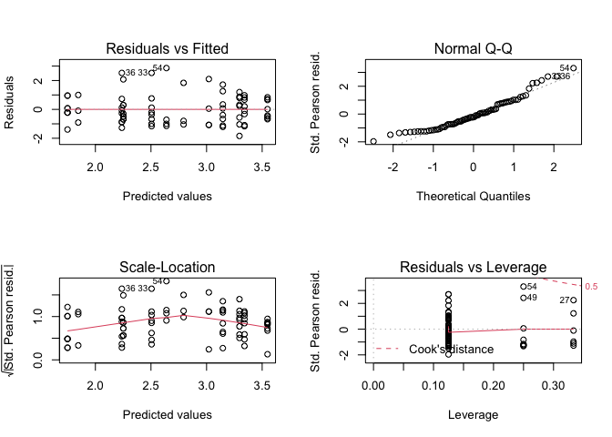
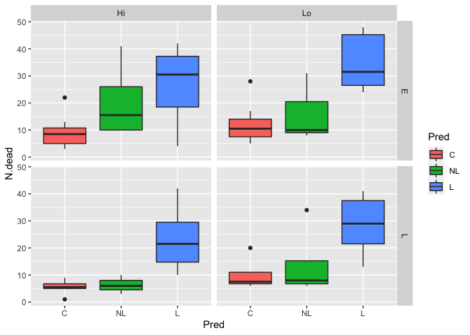
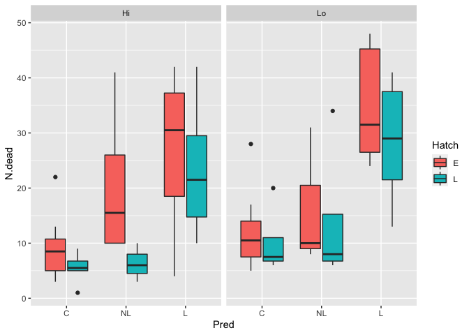
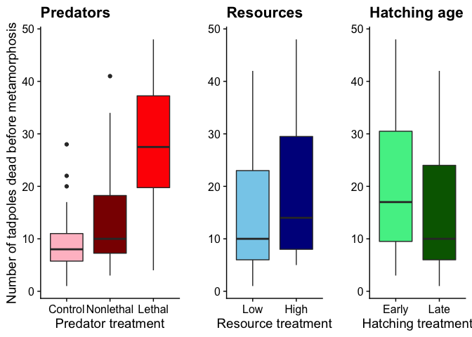

Chapter 7 Sample Answers
================

This page provides sample answers to the assignment at the end of
Chapter 7 of Applied Statistics with R: A Practical Guide for the Life
Sciences by Justin Touchon. Chapter 7 introduces you to *Generalized
Linear Models*, or GLMs. These are models that allow you to utilize
non-normally distributed data such as negative binomial data, Poisson
data, binomial data, and more. We first created a couple of new
variables which tabulated the number of tadpoles that lived and died in
each tank. As per usual, we continued practicing using the
***tidyverse*** to explore and manipulate our data and plot it
beautifully.

There are two assignments to do to continue working on the skills you
are building. As always, my hope is that you are here either because 1)
you want to check the answers you got to make sure you completed the
assignments correctly, or 2) you got stumped and need some help. Either
way, you will learn much more if you have already spent some time
working through the assignments on your own. If you haven’t done that,
close this page and go work on it! :) The first of the assignments is
straightforward, whereas the second is more open-ended (as is often the
case with visualizing data).

<span style="color: #009933;">

# Question 1

**Explore how all three predictors from the experiment (Hatch, Pred, and
Res) affect (or don’t affect) the number of animals that died before
metamorphosis. Start with the full model including all interactions and
reduce it to the minimal adequate model, aka the model with just
significant predictors.**

</span>

As always, let’s load any packages we will need and create the “byTank”
version of the data. We also need to make sure we have the *N.alive* and
*N.dead* variables that were created in Chapter 7. You probably already
have those in your data frame, so you may not need to do this step!

``` r
library(MASS)
library(car)
library(emmeans)
library(cowplot)
library(tidyverse)
```

    ## `summarise()` has grouped output by 'Tank.Unique', 'Pred', 'Res', 'Hatch'. You can override using the `.groups` argument.

    ## Rows: 78
    ## Columns: 18
    ## Groups: Tank.Unique, Pred, Res, Hatch [78]
    ## $ Tank.Unique           <int> 1, 2, 3, 4, 5, 6, 7, 8, 9, 10, 11, 12, 13, 14, 1…
    ## $ Pred                  <fct> NL, C, C, L, NL, L, NL, C, L, C, NL, L, NL, NL, …
    ## $ Res                   <fct> Hi, Hi, Hi, Lo, Hi, Hi, Lo, Lo, Hi, Lo, Lo, Lo, …
    ## $ Hatch                 <fct> L, E, L, L, E, E, L, E, L, L, E, E, L, L, E, L, …
    ## $ Block                 <int> 1, 1, 1, 1, 1, 1, 1, 1, 1, 1, 1, 1, 2, 2, 2, 2, …
    ## $ Age.DPO               <dbl> 47.19149, 45.38095, 53.82222, 56.92308, 64.75000…
    ## $ Age.FromEmergence     <dbl> 13.19149, 11.38095, 19.82222, 22.92308, 30.75000…
    ## $ SVL.initial           <dbl> 19.42553, 18.40476, 18.92667, 18.82692, 19.71500…
    ## $ Tail.initial          <dbl> 4.834043, 5.369048, 4.802222, 4.634615, 5.435000…
    ## $ SVL.final             <dbl> 19.65957, 19.00952, 19.12000, 19.11538, 20.11000…
    ## $ Mass.final            <dbl> 0.4178723, 0.3821429, 0.4117778, 0.3823077, 0.48…
    ## $ Resorb.days           <dbl> 3.489362, 3.785714, 3.511111, 3.653846, 4.225000…
    ## $ N.alive               <int> 47, 42, 45, 26, 40, 8, 43, 39, 23, 44, 42, 22, 4…
    ## $ N.dead                <dbl> 3, 8, 5, 24, 10, 42, 7, 11, 27, 6, 8, 28, 6, 6, …
    ## $ log.SVL.final         <dbl> 2.978564, 2.944940, 2.950735, 2.950493, 3.001217…
    ## $ log.Age.FromEmergence <dbl> 2.579572, 2.431941, 2.986804, 3.132144, 3.425890…
    ## $ log.Age.DPO           <dbl> 3.854214, 3.815092, 3.985686, 4.041701, 4.170534…
    ## $ log.Mass.final        <dbl> -0.8725793, -0.9619608, -0.8872714, -0.9615295, …

The model we are going to make is straightforward (hopefully). We are
essentially doing the same thing we did in Chapter 6, but now we are
going to be using a GLM instead of an LM. As we saw in Chapter 7, when
we are working with the *N.dead* data, we could either log-transform the
data or we could use the function **glm.nb()** in the ***MASS*** package
to assume a Negative Binomial error distribution. The latter approach is
what I will do here. This decision is in part based on the type of data
we are working with. They are whole counts of things (in this case, dead
tadpoles) and so cannot be negative and cannot be partial values. These
sorts of data just make sense for a Poisson or Negative Binomial
distribution.

First, let’s make the full model including all three predictors (Pred,
Res, and Hatch) and all of their two- and three-way interactions.

``` r
glm1<-glm.nb(N.dead~Pred*Res*Hatch, data=RxP.byTank)
par(mfrow=c(2,2))
plot(glm1)
```

<!-- -->

Okay, those diagnostic plots look pretty good overall. Next, let’s look
at the summary of the model, particularly focusing on the relationship
between the residual deviance and the degrees of freedom. Recall that a
model with a residucal deviance of more than 2X the degrees of freedom
would be considered *overdispersed*.

``` r
summary(glm1)
```

    ## 
    ## Call:
    ## glm.nb(formula = N.dead ~ Pred * Res * Hatch, data = RxP.byTank, 
    ##     init.theta = 5.628263105, link = log)
    ## 
    ## Deviance Residuals: 
    ##     Min       1Q   Median       3Q      Max  
    ## -2.8681  -0.7986  -0.2170   0.6426   2.1571  
    ## 
    ## Coefficients:
    ##                     Estimate Std. Error z value Pr(>|z|)    
    ## (Intercept)          2.23805    0.18853  11.871  < 2e-16 ***
    ## PredNL               0.78238    0.30357   2.577  0.00996 ** 
    ## PredL                1.05779    0.24976   4.235 2.28e-05 ***
    ## ResLo                0.26748    0.26068   1.026  0.30486    
    ## HatchL              -0.48885    0.28194  -1.734  0.08294 .  
    ## PredNL:ResLo        -0.49470    0.45189  -1.095  0.27363    
    ## PredL:ResLo         -0.01514    0.34728  -0.044  0.96523    
    ## PredNL:HatchL       -0.68575    0.49796  -1.377  0.16847    
    ## PredL:HatchL         0.33931    0.36595   0.927  0.35381    
    ## ResLo:HatchL         0.23461    0.38376   0.611  0.54097    
    ## PredNL:ResLo:HatchL  0.78583    0.67650   1.162  0.24539    
    ## PredL:ResLo:HatchL  -0.29217    0.50412  -0.580  0.56221    
    ## ---
    ## Signif. codes:  0 '***' 0.001 '**' 0.01 '*' 0.05 '.' 0.1 ' ' 1
    ## 
    ## (Dispersion parameter for Negative Binomial(5.6283) family taken to be 1)
    ## 
    ##     Null deviance: 180.803  on 77  degrees of freedom
    ## Residual deviance:  78.756  on 66  degrees of freedom
    ## AIC: 554.25
    ## 
    ## Number of Fisher Scoring iterations: 1
    ## 
    ## 
    ##               Theta:  5.63 
    ##           Std. Err.:  1.23 
    ## 
    ##  2 x log-likelihood:  -528.251

This looks good. Our most has a residual deviance of 78.8 on 66 degrees
of freedom, implying that our model fits well enough. Now, let’s assess
the significance of our predictors using the **Anova()** function from
the ***car*** package.

``` r
Anova(glm1)
```

    ## Analysis of Deviance Table (Type II tests)
    ## 
    ## Response: N.dead
    ##                LR Chisq Df Pr(>Chisq)    
    ## Pred             85.384  2  < 2.2e-16 ***
    ## Res               5.995  1   0.014347 *  
    ## Hatch             7.776  1   0.005293 ** 
    ## Pred:Res          0.429  2   0.806767    
    ## Pred:Hatch        2.051  2   0.358658    
    ## Res:Hatch         0.963  1   0.326548    
    ## Pred:Res:Hatch    2.778  2   0.249267    
    ## ---
    ## Signif. codes:  0 '***' 0.001 '**' 0.01 '*' 0.05 '.' 0.1 ' ' 1

This tells us that all three of our predictors have a significant impact
on how many animals survived to metamorphosis. None of the two-way
interactions are significant, nor is the three-way interaction, so let’s
remove them and re-run the model with just the additive effects of the
predictors. We can just change the \*’s in our model above to +’s

``` r
glm2<-glm.nb(N.dead~Pred+Res+Hatch, data=RxP.byTank)
summary(glm2)
```

    ## 
    ## Call:
    ## glm.nb(formula = N.dead ~ Pred + Res + Hatch, data = RxP.byTank, 
    ##     init.theta = 5.096376746, link = log)
    ## 
    ## Deviance Residuals: 
    ##     Min       1Q   Median       3Q      Max  
    ## -2.8589  -0.7901  -0.1880   0.5382   2.4731  
    ## 
    ## Coefficients:
    ##             Estimate Std. Error z value Pr(>|z|)    
    ## (Intercept)   2.2255     0.1273  17.485  < 2e-16 ***
    ## PredNL        0.4674     0.1694   2.760  0.00578 ** 
    ## PredL         1.1395     0.1300   8.764  < 2e-16 ***
    ## ResLo         0.2604     0.1168   2.230  0.02574 *  
    ## HatchL       -0.3234     0.1168  -2.768  0.00563 ** 
    ## ---
    ## Signif. codes:  0 '***' 0.001 '**' 0.01 '*' 0.05 '.' 0.1 ' ' 1
    ## 
    ## (Dispersion parameter for Negative Binomial(5.0964) family taken to be 1)
    ## 
    ##     Null deviance: 168.186  on 77  degrees of freedom
    ## Residual deviance:  79.333  on 73  degrees of freedom
    ## AIC: 546.4
    ## 
    ## Number of Fisher Scoring iterations: 1
    ## 
    ## 
    ##               Theta:  5.10 
    ##           Std. Err.:  1.09 
    ## 
    ##  2 x log-likelihood:  -534.399

``` r
Anova(glm2)
```

    ## Analysis of Deviance Table (Type II tests)
    ## 
    ## Response: N.dead
    ##       LR Chisq Df Pr(>Chisq)    
    ## Pred    78.770  2  < 2.2e-16 ***
    ## Res      4.955  1   0.026017 *  
    ## Hatch    7.615  1   0.005787 ** 
    ## ---
    ## Signif. codes:  0 '***' 0.001 '**' 0.01 '*' 0.05 '.' 0.1 ' ' 1

Removing the higher-order effecs — the two-way and three-way
interactions — did not have a major effect on the estimate of
significance of our three predictors. Thus, in the end we can say that
all three treatment variables, hatching early or late, being fed high or
low levels of resources, or being exposed to caged or live predators as
compared to a predator-free control, affected the survival of tadpoles
all the way to metamorphosis.

<span style="color: #009933;">

# Question 2

**Plot the data in an appropriate manner to visualize what significant
affects you find.**

</span>

Okay, so we have three predictors to explore. There are lots of ways we
could do this. For example, we could use **qplot()** to facet in two
dimensions (i.e., for two predictors), like this.

``` r
qplot(data=RxP.byTank, x=Pred, y=N.dead, fill=Pred, facets=Hatch~Res, geom="boxplot")
```

<!-- -->

That plot very effectively shows the predator effect, but it makes it
pretty difficult to discern the resource or hatching effects. Maybe it
looks like mortality is a little higher in the Lo resource treatment,
but it is difficult to tell. It’s pretty impossible to tell if mortality
is higher or lower in the Early or Late hatched treatments.

We could also facet based on one variable and fill based on another,
like this.

``` r
qplot(data=RxP.byTank, x=Pred, y=N.dead, fill=Hatch, facets=.~Res, geom="boxplot")
```

<!-- -->

Okay, this is better. We can still see the predator effect (mortality
increases from C to NL to L), and we can see that in general Early
hatched tanks had higher mortality than Late hatched tanks. We can also
see that, in general, it looks like the Low resource tanks had higher
mortality than the High resource tanks.

Those are nice, but to most accurately reflect our statistics we should
probably just plot each effect individually. Our statistics are really
telling us that if you ignore all the other treatments, there is an
effect of resources, for example. Or if you ignore the predator and
resource treatments, there is an effect of hatching age. So to most
accurately visualize those effects, we should not parse out all the
different treatment combinations but rather just plot the individual
effects.

I’m going to store each of the plots as an object and then plot them all
together using the **plot\_grid()** function in the ***cowplot***
package. I’m also going to add some labels and colors and such. In the
code below, you’ll notice that I’ve removed the y-axis labels in the 2nd
and 3rd panels of the figure. That is because they are unnecessary,
since the first panel sets up the axis for all three panels. This set of
figures is a very nice way to display the results of our statistics, and
makes the effects we see in the stats easy to interpret. You may also
notice in the last line of the code, the **plot\_grid()** line, I’ve
adjusted the relative widths of the different panels with the
*rel\_widths=* argument. Since the first panel has three groups, as
compared with just two groups in the second and third panels, the boxes
would look a little squished if all three panels were the same width.
After some trial and error, I settled on making the first panel 1.3X
wider than the other panels, which looks pretty good to me.

``` r
pred.plot<-qplot(data=RxP.byTank, x=Pred, y=N.dead, geom="boxplot", fill=Pred)+
  labs(y="Number of tadpoles dead before metamorphosis", x="Predator treatment", title="Predators")+
  scale_fill_manual(values=c("pink","dark red","red"), guide="none")+
  scale_x_discrete(labels=c("Control","Nonlethal","Lethal"))+
  theme_cowplot()
res.plot<-qplot(data=RxP.byTank, x=Res, y=N.dead, geom="boxplot", fill=Res)+
  labs(y="", x="Resource treatment", title="Resources")+
  scale_fill_manual(values=c("skyblue","dark blue"), guide="none")+
  scale_x_discrete(labels=c("Low","High"))+
  theme_cowplot()
hatch.plot<-qplot(data=RxP.byTank, x=Hatch, y=N.dead, geom="boxplot", fill=Hatch)+
  labs(y="", x="Hatching treatment", title="Hatching age")+
  scale_fill_manual(values=c("seagreen2","dark green"), guide="none")+
  scale_x_discrete(labels=c("Early","Late"))+
  theme_cowplot()
plot_grid(pred.plot, res.plot, hatch.plot, nrow=1, rel_widths=c(1.3,1,1))
```

<!-- -->
