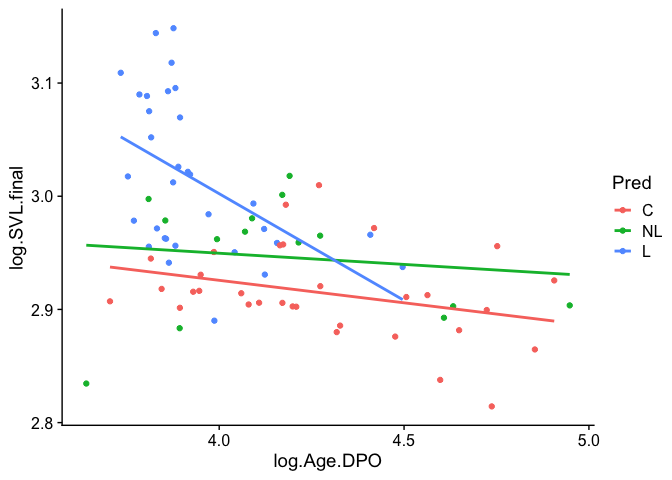
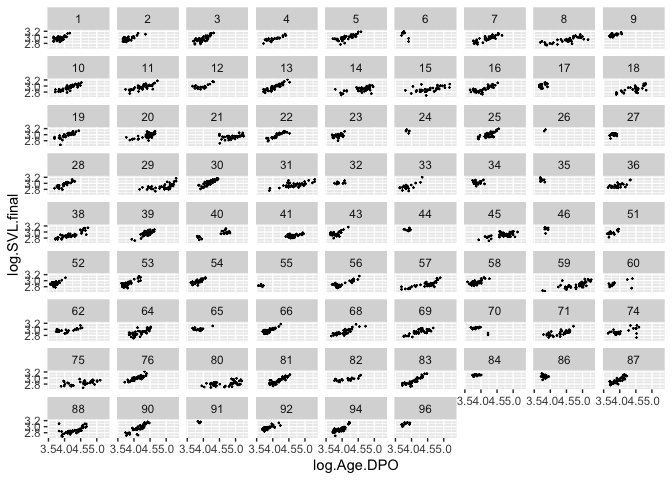
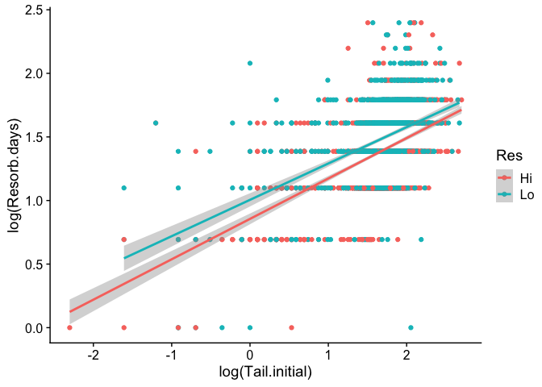

Chapter 8 Sample Answers
================
Justin Touchon
8/3/2021

This page provides sample answers to the assignment at the end of
Chapter 8 of Applied Statistics with R: A Practical Guide for the Life
Sciences by Justin Touchon. Chapter 8 introduces you to *Mixed Effects
Models*, also known just as Mixed Models or also as Random Effects
Models. Mixed models are incredibly useful in the life sciences, as they
allow you to account for additional sources of variation beyond just the
the things you are interested in. For this reason, they can also be used
to account for non-independence that may occur in your data.

There was only one assignment listed at the end of Chapter 8. That said,
it is a pretty big and open ended one! You could of course explore more
models as well.

<span style="color: #009933;">

# Question 1

**Rerun the ANCOVA models you explored in Chapter 6 but using all of the
data and include random effects for block and tank within block. Don’t
forget to check the model fit via the Q-Q plot. How does it look?**

</span>

Depending on which models you want to explore here, you might need
different packages. The ANCOVA we created in Chapter 6 was this:

``` r
lm5<-lm(log.SVL.final~log.Age.DPO*Pred, data=RxP.byTank)
```

You were also tasked with creating several other models of your choosing
in order explore other interactions between the continuous and
categorical predictors in the data frame. For example, in the sample set
of answers I’ve created for Chapter 6, I explored the following models:

``` r
lm.tail<-lm(Tail.initial~Hatch*Pred, data=RxP.byTank)
lm.resorb2<-lm(log(Resorb.days)~log(Tail.initial)*Res, data=RxP.byTank)
```

You might have created different models when you working through the
homework, but these are the models I created and what I will be working
through here.

As always, let’s load any packages we will need. For the first time
though, we will be working with the RxP.clean data frame, since the
mixed models will allow us to use all the data.

``` r
library(MASS)
library(car)
library(emmeans)
library(cowplot)
library(tidyverse)
library(lattice)
library(lme4)
```

``` r
RxP.clean<-read.csv("~/Desktop/Biostats_class/RxP/RxP_clean.csv", stringsAsFactors = T)
#I'm going to go ahead and make the logged versions of these variables
RxP.clean$log.SVL.final<-log(RxP.clean$SVL.final)
RxP.clean$log.Age.FromEmergence<-log(RxP.clean$Age.FromEmergence)
RxP.clean$log.Age.DPO<-log(RxP.clean$Age.DPO)
RxP.clean$log.Mass.final<-log(RxP.clean$Mass.final)
#Remember to reorder the Pred factor
RxP.clean$Pred<-factor(RxP.clean$Pred, levels=c("C","NL","L"))
str(RxP.clean)
```

    ## 'data.frame':    2493 obs. of  18 variables:
    ##  $ Ind                  : int  1 2 3 4 5 6 7 8 9 10 ...
    ##  $ Block                : int  5 5 5 5 5 5 5 2 2 1 ...
    ##  $ Tank                 : int  7 4 4 7 10 4 4 5 4 1 ...
    ##  $ Tank.Unique          : int  55 52 52 55 58 52 52 17 16 1 ...
    ##  $ Hatch                : Factor w/ 2 levels "E","L": 1 2 2 1 2 2 2 1 2 2 ...
    ##  $ Pred                 : Factor w/ 3 levels "C","NL","L": 2 1 1 2 3 1 1 3 1 2 ...
    ##  $ Res                  : Factor w/ 2 levels "Hi","Lo": 1 1 1 1 1 1 1 1 1 1 ...
    ##  $ Age.DPO              : int  35 35 35 35 36 36 36 39 39 39 ...
    ##  $ Age.FromEmergence    : int  1 1 1 1 2 2 2 5 5 5 ...
    ##  $ SVL.initial          : num  18 17.7 18.1 16.8 18.7 17.5 17.3 19.6 16.5 17.5 ...
    ##  $ Tail.initial         : num  5.4 1.1 5 6.4 6.3 4.4 1.3 1.5 2 5.1 ...
    ##  $ SVL.final            : num  17 18 17.8 17.1 19.3 17.8 17.9 19.6 17.7 19.5 ...
    ##  $ Mass.final           : num  0.38 0.35 0.41 0.3 0.46 0.3 0.42 0.5 0.33 0.46 ...
    ##  $ Resorb.days          : int  3 3 3 3 3 4 2 2 2 3 ...
    ##  $ log.SVL.final        : num  2.83 2.89 2.88 2.84 2.96 ...
    ##  $ log.Age.FromEmergence: num  0 0 0 0 0.693 ...
    ##  $ log.Age.DPO          : num  3.56 3.56 3.56 3.56 3.58 ...
    ##  $ log.Mass.final       : num  -0.968 -1.05 -0.892 -1.204 -0.777 ...

## The effect of Predators on SVL while controlling for age at metamorphosis

Let’s start by rerunning the model from Chapter 6, just to refresh
ourselves on what we concluded.

``` r
lm5<-lm(log.SVL.final~log.Age.DPO*Pred, data=RxP.byTank)
Anova(lm5)
```

    ## Anova Table (Type II tests)
    ## 
    ## Response: log.SVL.final
    ##                    Sum Sq Df F value    Pr(>F)    
    ## log.Age.DPO      0.019898  1  7.2824   0.00867 ** 
    ## Pred             0.079871  2 14.6155 4.706e-06 ***
    ## log.Age.DPO:Pred 0.019731  2  3.6105   0.03204 *  
    ## Residuals        0.196732 72                      
    ## ---
    ## Signif. codes:  0 '***' 0.001 '**' 0.01 '*' 0.05 '.' 0.1 ' ' 1

The initial analysis shows us that both predators and age at
metamorphosis influence final SVL at metamorphosis, and the effect of
age differed for each of the predator treatments (the significant
interaction).

A quick visualization of the results demonstrates that this is primarily
due to the Lethal predator treatment. The regressions for the Nonlethal
and Control treatments are pretty similar.

``` r
qplot(data=RxP.byTank, x=log.Age.DPO, y=log.SVL.final, geom="point", col=Pred)+
  geom_smooth(method="lm", se=F)+
  theme_cowplot()
```

    ## `geom_smooth()` using formula 'y ~ x'

<!-- -->

Okay, what will happen when we use all the data and control for Block
and Tank with random effects? Recall that to accurately assess the
significance of our fixed effects, we need to use Likelihood Ratio
Tests. Below I’ve made four models that each differ, successively, by
one predictor. The first model (lmm5) contains three predictors: age at
metamorphosis, predator treatment, and the interaction between them. The
second model (lmm5.1) contains just age at metamorphosis and predator
treatment, but not the interaction between them. The last two models
contain just age at metamorphosis (lmm5.2) or predator treatment
(lmm5.3).

``` r
lmm5<-lmer(log.SVL.final~log.Age.DPO*Pred+(1|Block/Tank.Unique), data=RxP.clean)
lmm5.1<-lmer(log.SVL.final~log.Age.DPO+Pred+(1|Block/Tank.Unique), data=RxP.clean)
lmm5.2<-lmer(log.SVL.final~log.Age.DPO+(1|Block/Tank.Unique), data=RxP.clean)
```

    ## Warning in checkConv(attr(opt, "derivs"), opt$par, ctrl = control$checkConv, :
    ## unable to evaluate scaled gradient

    ## Warning in checkConv(attr(opt, "derivs"), opt$par, ctrl = control$checkConv, :
    ## Model failed to converge: degenerate Hessian with 1 negative eigenvalues

``` r
lmm5.3<-lmer(log.SVL.final~Pred+(1|Block/Tank.Unique), data=RxP.clean)
```

If you just ran those models, you might have gotten a warning for
lmm5.2. This is an excellent opportunity to talk about something that is
very important but which I didn’t have space to really dive into in the
book. What do you do when you get a bunch of red text telling you things
like “Model failed to converge: degenerate Hessian with 1 negative
eigenvalues” or “unable to evaluate scaled gradient”. Those warnings
sound scary and terrible right? Yikes! First, it is important to
recognize that they are *warnings* and not *errors*. An error means your
model failed to run. A warning means it ran but R wasn’t happy about
something. Warnings mean you need to do a little digging to figure out
if you have a problem on your hands or not. For example, we can examine
the summary output to confirm the model ran.

``` r
lmm5.2<-lmer(log.SVL.final~log.Age.DPO+(1|Block/Tank.Unique), data=RxP.clean)
```

    ## Warning in checkConv(attr(opt, "derivs"), opt$par, ctrl = control$checkConv, :
    ## unable to evaluate scaled gradient

    ## Warning in checkConv(attr(opt, "derivs"), opt$par, ctrl = control$checkConv, :
    ## Model failed to converge: degenerate Hessian with 1 negative eigenvalues

``` r
summary(lmm5.2)
```

    ## Linear mixed model fit by REML ['lmerMod']
    ## Formula: log.SVL.final ~ log.Age.DPO + (1 | Block/Tank.Unique)
    ##    Data: RxP.clean
    ## 
    ## REML criterion at convergence: -6522.6
    ## 
    ## Scaled residuals: 
    ##     Min      1Q  Median      3Q     Max 
    ## -5.0540 -0.5785  0.0253  0.6223  5.4815 
    ## 
    ## Random effects:
    ##  Groups            Name        Variance  Std.Dev. 
    ##  Tank.Unique:Block (Intercept) 1.574e-02 1.254e-01
    ##  Block             (Intercept) 7.745e-09 8.801e-05
    ##  Residual                      3.663e-03 6.053e-02
    ## Number of obs: 2493, groups:  Tank.Unique:Block, 78; Block, 8
    ## 
    ## Fixed effects:
    ##             Estimate Std. Error t value
    ## (Intercept)  1.97286    0.02667   73.97
    ## log.Age.DPO  0.24058    0.00550   43.74
    ## 
    ## Correlation of Fixed Effects:
    ##             (Intr)
    ## log.Age.DPO -0.845
    ## optimizer (nloptwrap) convergence code: 0 (OK)
    ## unable to evaluate scaled gradient
    ## Model failed to converge: degenerate  Hessian with 1 negative eigenvalues

Despite the warning, the model calculated the slope (0.24058) and
intercept (1.97286) for our model. In this case, these warnings mean
that R couldn’t figure out an answer to our model. It couldn’t figure
out the single best relationship between our predictor and response
variables while also accounting for the random effects we’ve coded.
Let’s explore further!

## Try to understand what is causing the problem

The easiest way to explore what is causing a problem is to remove
various things and rerun your model to see if it will run. Sometimes you
might get a warning (or an error) because you’ve coded your random
effects structures to be too complicated. For example, if we remove
*Block* from our model, then it runs without a problem and gives us the
exact same estimates for the slope and intercept.

``` r
lmm5.2<-lmer(log.SVL.final~log.Age.DPO+(1|Block), data=RxP.clean)
summary(lmm5.2)
```

    ## Linear mixed model fit by REML ['lmerMod']
    ## Formula: log.SVL.final ~ log.Age.DPO + (1 | Block)
    ##    Data: RxP.clean
    ## 
    ## REML criterion at convergence: -4669.8
    ## 
    ## Scaled residuals: 
    ##     Min      1Q  Median      3Q     Max 
    ## -2.8727 -0.6998 -0.0218  0.6702  3.2655 
    ## 
    ## Random effects:
    ##  Groups   Name        Variance  Std.Dev.
    ##  Block    (Intercept) 0.0005655 0.02378 
    ##  Residual             0.0088576 0.09411 
    ## Number of obs: 2493, groups:  Block, 8
    ## 
    ## Fixed effects:
    ##             Estimate Std. Error t value
    ## (Intercept) 2.821456   0.023479 120.167
    ## log.Age.DPO 0.027924   0.005254   5.314
    ## 
    ## Correlation of Fixed Effects:
    ##             (Intr)
    ## log.Age.DPO -0.930

But why does R not give us a warning when we include both *Block* and
*Tank.Unique* and a more complex set of predictors? Let’s explore what
it looks like when we plot the data for each individual tank.

``` r
ggplot(data=RxP.clean, aes(x=log.Age.DPO, y=log.SVL.final))+
  geom_point(size=0.2)+
  facet_wrap(facets=.~Tank.Unique)
```

<!-- -->

This is informative because it shows us that there are a few tanks with
very few individuals. Model lmm5.2 is essentially creating a linear
regression for each tank, then pooling all those regressions to get the
overall regression for our fixed effect. But tank 26 only has two
individuals! We can verify this if we calculate how many individuals are
in each Tank.

``` r
RxP.clean %>% 
  group_by(Tank.Unique) %>% 
  summarize(Obs = length(Tank.Unique))
```

    ## # A tibble: 78 x 2
    ##    Tank.Unique   Obs
    ##          <int> <int>
    ##  1           1    47
    ##  2           2    42
    ##  3           3    45
    ##  4           4    26
    ##  5           5    40
    ##  6           6     8
    ##  7           7    43
    ##  8           8    39
    ##  9           9    23
    ## 10          10    44
    ## # … with 68 more rows

Since we all know the shortest distance between two points is a straight
line, the regression will end up drawing a straight line and will have
no estimate of variance around the regression, which is not good. R is
essentially telling us that it we don’t have enough data to really
calculate the regression. One way to verify if tank 26 is indeed the
root of the problem would be to run the model without it. We can use
square brackets to remove just that one tank.

``` r
lmm5.2<-lmer(log.SVL.final~log.Age.DPO+(1|Block/Tank.Unique), data=RxP.clean[RxP.clean$Tank.Unique!=26,])
```

    ## boundary (singular) fit: see ?isSingular

``` r
summary(lmm5.2)
```

    ## Linear mixed model fit by REML ['lmerMod']
    ## Formula: log.SVL.final ~ log.Age.DPO + (1 | Block/Tank.Unique)
    ##    Data: RxP.clean[RxP.clean$Tank.Unique != 26, ]
    ## 
    ## REML criterion at convergence: -6521.2
    ## 
    ## Scaled residuals: 
    ##     Min      1Q  Median      3Q     Max 
    ## -5.0527 -0.5788  0.0252  0.6203  5.4804 
    ## 
    ## Random effects:
    ##  Groups            Name        Variance Std.Dev.
    ##  Tank.Unique:Block (Intercept) 0.015233 0.12342 
    ##  Block             (Intercept) 0.000000 0.00000 
    ##  Residual                      0.003664 0.06053 
    ## Number of obs: 2491, groups:  Tank.Unique:Block, 77; Block, 8
    ## 
    ## Fixed effects:
    ##             Estimate Std. Error t value
    ## (Intercept)  1.97011    0.02661   74.04
    ## log.Age.DPO  0.24053    0.00550   43.74
    ## 
    ## Correlation of Fixed Effects:
    ##             (Intr)
    ## log.Age.DPO -0.847
    ## optimizer (nloptwrap) convergence code: 0 (OK)
    ## boundary (singular) fit: see ?isSingular

The model runs and we get a different warning telling us that our model
has a singular fit. That is probably not a big deal. A singular model
just means that one or more of the estimated variances are close to
zero, but that is probably okay. We can also see that we once again get
essentially the same values for our slope and intercept.

Based on all of this, we can conclude that the warning we received at
the outset is probably not a big deal. This isn’t always the case of
course. Sometimes a warning really means you can’t trust your results.
In this case, however, we are probably in fine shape.

## Change the optimizer

One other thing to try when you get a warning or an error is to fiddle
with how **lmer()** is actually calculating your model. If you do a
little digging on the internet, you can read lots about the guts of a
complex function like **lmer()**. One thing that makes the function run
is an optimizer algorithm, and there are of course different built in
options. When you run in to a warning like we have here, one solution is
to change the optimizer function from the default. One alternative that
works well is called “Nelder-Mead” and you can change the function by
adding an argument to your model.

``` r
lmm5.2<-lmer(log.SVL.final~log.Age.DPO+(1|Block/Tank.Unique), data=RxP.clean, control = lmerControl(optimizer ="Nelder_Mead"))
summary(lmm5.2)
```

    ## Linear mixed model fit by REML ['lmerMod']
    ## Formula: log.SVL.final ~ log.Age.DPO + (1 | Block/Tank.Unique)
    ##    Data: RxP.clean
    ## Control: lmerControl(optimizer = "Nelder_Mead")
    ## 
    ## REML criterion at convergence: -6522.6
    ## 
    ## Scaled residuals: 
    ##     Min      1Q  Median      3Q     Max 
    ## -5.0539 -0.5785  0.0253  0.6224  5.4815 
    ## 
    ## Random effects:
    ##  Groups            Name        Variance  Std.Dev.
    ##  Tank.Unique:Block (Intercept) 1.572e-02 0.12537 
    ##  Block             (Intercept) 2.181e-05 0.00467 
    ##  Residual                      3.663e-03 0.06053 
    ## Number of obs: 2493, groups:  Tank.Unique:Block, 78; Block, 8
    ## 
    ## Fixed effects:
    ##             Estimate Std. Error t value
    ## (Intercept)  1.97284    0.02672   73.83
    ## log.Age.DPO  0.24058    0.00550   43.74
    ## 
    ## Correlation of Fixed Effects:
    ##             (Intr)
    ## log.Age.DPO -0.843

Notice that we got no warning and once again we got essentially the same
slope and intercept as we originally received. This is further evidence
that the original warning is probably a false alarm that our model is in
trouble. Thus, let’s ignore the warning and proceed with assessing
significance of the original version of the model.

## Likelihood ratio tests

Now, we can assess the significance of the different predictors.

``` r
lmm5<-lmer(log.SVL.final~log.Age.DPO*Pred+(1|Block/Tank.Unique), data=RxP.clean)
lmm5.1<-lmer(log.SVL.final~log.Age.DPO+Pred+(1|Block/Tank.Unique), data=RxP.clean)
lmm5.2<-lmer(log.SVL.final~log.Age.DPO+(1|Block/Tank.Unique), data=RxP.clean)
lmm5.3<-lmer(log.SVL.final~Pred+(1|Block/Tank.Unique), data=RxP.clean)
```

First, we compare lmm5 (the full model) with lmm5.1, which lacks the
interaction. That will tell us if the interaction is significant or not.

``` r
anova(lmm5,lmm5.1)#Significance of the interaction
```

    ## refitting model(s) with ML (instead of REML)

    ## Data: RxP.clean
    ## Models:
    ## lmm5.1: log.SVL.final ~ log.Age.DPO + Pred + (1 | Block/Tank.Unique)
    ## lmm5: log.SVL.final ~ log.Age.DPO * Pred + (1 | Block/Tank.Unique)
    ##        npar     AIC     BIC logLik deviance  Chisq Df Pr(>Chisq)
    ## lmm5.1    7 -6570.1 -6529.3 3292.0  -6584.1                     
    ## lmm5      9 -6570.1 -6517.7 3294.1  -6588.1 4.0468  2     0.1322

``` r
anova(lmm5.1,lmm5.2)#Significance of Pred
```

    ## refitting model(s) with ML (instead of REML)

    ## Data: RxP.clean
    ## Models:
    ## lmm5.2: log.SVL.final ~ log.Age.DPO + (1 | Block/Tank.Unique)
    ## lmm5.1: log.SVL.final ~ log.Age.DPO + Pred + (1 | Block/Tank.Unique)
    ##        npar     AIC     BIC logLik deviance  Chisq Df Pr(>Chisq)    
    ## lmm5.2    5 -6527.8 -6498.7 3268.9  -6537.8                         
    ## lmm5.1    7 -6570.1 -6529.3 3292.0  -6584.1 46.214  2  9.222e-11 ***
    ## ---
    ## Signif. codes:  0 '***' 0.001 '**' 0.01 '*' 0.05 '.' 0.1 ' ' 1

``` r
anova(lmm5.1,lmm5.3)#Significance of log.Age.DPO
```

    ## refitting model(s) with ML (instead of REML)

    ## Data: RxP.clean
    ## Models:
    ## lmm5.3: log.SVL.final ~ Pred + (1 | Block/Tank.Unique)
    ## lmm5.1: log.SVL.final ~ log.Age.DPO + Pred + (1 | Block/Tank.Unique)
    ##        npar     AIC     BIC logLik deviance  Chisq Df Pr(>Chisq)    
    ## lmm5.3    6 -5232.2 -5197.3 2622.1  -5244.2                         
    ## lmm5.1    7 -6570.1 -6529.3 3292.0  -6584.1 1339.8  1  < 2.2e-16 ***
    ## ---
    ## Signif. codes:  0 '***' 0.001 '**' 0.01 '*' 0.05 '.' 0.1 ' ' 1

This is really interesting. By including all of our data and controlling
for the lack of independence of metamorphs coming out of tanks which are
themselves nested in blocks, we have concluded that there is not
actually a significant interaction between the predator treatments and
age at metamorphosis. That’s a really important conclusion and including
more data fundamentally changed our view of the answer. We can confirm
that the different predator treatments do not differ with
**emtrends()**.

``` r
pairs(emtrends(lmm5, specs="Pred", var="log.Age.DPO"))
```

    ##  contrast estimate     SE   df t.ratio p.value
    ##  C - NL    0.00845 0.0138 2481 0.612   0.8134 
    ##  C - L     0.02943 0.0147 2470 2.001   0.1122 
    ##  NL - L    0.02097 0.0175 2477 1.196   0.4558 
    ## 
    ## Degrees-of-freedom method: kenward-roger 
    ## P value adjustment: tukey method for comparing a family of 3 estimates

## The interaction between Hatching Age and Predators on Tail length at metamorphosis

In the sample answers for Chapter 6, I ran the following model, which
examined if the predator treatment and the hatching age treatment
affected the length of the tail when metamorphs crawled out of the water
and we determined that predators, but not hatching age, do indeed alter
when froglets choose to crawl out of the water.

``` r
lm.tail<-lm(Tail.initial~Hatch*Pred, data=RxP.byTank)
Anova(lm.tail)
```

    ## Anova Table (Type II tests)
    ## 
    ## Response: Tail.initial
    ##            Sum Sq Df F value    Pr(>F)    
    ## Hatch       0.920  1  1.5241 0.2210101    
    ## Pred        9.298  2  7.7018 0.0009309 ***
    ## Hatch:Pred  1.334  2  1.1054 0.3366458    
    ## Residuals  43.459 72                      
    ## ---
    ## Signif. codes:  0 '***' 0.001 '**' 0.01 '*' 0.05 '.' 0.1 ' ' 1

What about when we include all the data?

``` r
lmm.tail<-lmer(Tail.initial~Hatch*Pred+(1|Block/Tank.Unique), data=RxP.clean)
lmm.tail1<-lmer(Tail.initial~Hatch+Pred+(1|Block/Tank.Unique), data=RxP.clean)
lmm.tail2<-lmer(Tail.initial~Hatch+(1|Block/Tank.Unique), data=RxP.clean)
lmm.tail3<-lmer(Tail.initial~Pred+(1|Block/Tank.Unique), data=RxP.clean)
anova(lmm.tail,lmm.tail1)
```

    ## refitting model(s) with ML (instead of REML)

    ## Data: RxP.clean
    ## Models:
    ## lmm.tail1: Tail.initial ~ Hatch + Pred + (1 | Block/Tank.Unique)
    ## lmm.tail: Tail.initial ~ Hatch * Pred + (1 | Block/Tank.Unique)
    ##           npar   AIC   BIC  logLik deviance  Chisq Df Pr(>Chisq)
    ## lmm.tail1    7 10970 11010 -5477.9    10956                     
    ## lmm.tail     9 10972 11025 -5477.1    10954 1.4708  2     0.4793

``` r
anova(lmm.tail1,lmm.tail2)
```

    ## refitting model(s) with ML (instead of REML)

    ## Data: RxP.clean
    ## Models:
    ## lmm.tail2: Tail.initial ~ Hatch + (1 | Block/Tank.Unique)
    ## lmm.tail1: Tail.initial ~ Hatch + Pred + (1 | Block/Tank.Unique)
    ##           npar   AIC   BIC  logLik deviance  Chisq Df Pr(>Chisq)   
    ## lmm.tail2    5 10975 11004 -5482.5    10965                        
    ## lmm.tail1    7 10970 11010 -5477.9    10956 9.2877  2   0.009621 **
    ## ---
    ## Signif. codes:  0 '***' 0.001 '**' 0.01 '*' 0.05 '.' 0.1 ' ' 1

``` r
anova(lmm.tail1,lmm.tail3)
```

    ## refitting model(s) with ML (instead of REML)

    ## Data: RxP.clean
    ## Models:
    ## lmm.tail3: Tail.initial ~ Pred + (1 | Block/Tank.Unique)
    ## lmm.tail1: Tail.initial ~ Hatch + Pred + (1 | Block/Tank.Unique)
    ##           npar   AIC   BIC  logLik deviance  Chisq Df Pr(>Chisq)
    ## lmm.tail3    6 10969 11004 -5478.4    10957                     
    ## lmm.tail1    7 10970 11010 -5477.9    10956 1.0117  1     0.3145

Our new analysis gives us the same result. Predators have a very
significant effect on tail length at metamorphosis, but hatching age
does not. With **emmeans()** we can see that the effect is driven,
understandably, by the lethal predators, which cause metamorphs to leave
the water with significantly more tail left than individuals from
control tanks.

``` r
pairs(emmeans(lmm.tail3, specs="Pred"))
```

    ##  contrast estimate    SE   df t.ratio p.value
    ##  C - NL    -0.0284 0.201 65.7 -0.141  0.9891 
    ##  C - L     -0.4506 0.154 70.2 -2.918  0.0130 
    ##  NL - L    -0.4222 0.212 76.3 -1.994  0.1205 
    ## 
    ## Degrees-of-freedom method: kenward-roger 
    ## P value adjustment: tukey method for comparing a family of 3 estimates

# The effect of Resources on the time needed to resorb the tail, while controlling for tail length

As a reminder, in the sample answers for Chapter 6 we settled on the
following model, which found that both tail length at metamorphosis and
the resources tadpoles had access to during the larval period affected
the rate at which they resorbed the tail into the body.

``` r
lm.resorb2<-lm(log(Resorb.days)~log(Tail.initial)*Res, data=RxP.byTank)
Anova(lm.resorb2)
```

    ## Anova Table (Type II tests)
    ## 
    ## Response: log(Resorb.days)
    ##                        Sum Sq Df F value    Pr(>F)    
    ## log(Tail.initial)     0.58309  1 84.7679 6.771e-14 ***
    ## Res                   0.13602  1 19.7735 3.014e-05 ***
    ## log(Tail.initial):Res 0.01754  1  2.5504    0.1145    
    ## Residuals             0.50903 74                      
    ## ---
    ## Signif. codes:  0 '***' 0.001 '**' 0.01 '*' 0.05 '.' 0.1 ' ' 1

Let’s explore if these results hold when we included all the data.

``` r
lmm.resorb2<-lmer(log(Resorb.days)~log(Tail.initial)*Res+(1|Block/Tank.Unique), data=RxP.clean)
```

    ## Error in qr.default(X, tol = tol, LAPACK = FALSE): NA/NaN/Inf in foreign function call (arg 1)

Uh-oh! That’s not a warning, that’s an error. At first, this might look
a little inscrutable, but what it means is that we have somehow created
some values that are either *NA*, *NaN* (Not a Number), or *Inf*
(infinite). Maybe the problem is that we are log-transforming something
that can’t be log-transformed? Let’s use the **table()** function to see
if there are any zero’s in our dataset, and if so, how many.

``` r
table(RxP.clean$Tail.initial)
```

    ## 
    ##    0  0.1  0.2  0.3  0.4  0.5  0.6  0.7  0.8  0.9    1  1.1  1.2  1.3  1.4  1.5 
    ##    8    1    4    2    7    6    3    3    5    9   12   17    8    7   17   18 
    ##  1.6  1.7  1.8  1.9    2  2.1  2.2  2.3  2.4  2.5  2.6  2.7  2.8  2.9    3  3.1 
    ##   16   19   13   14   22   11    9   12    7    5   14   11    7    6    4    4 
    ##  3.2  3.3  3.4  3.5  3.6  3.7  3.8  3.9    4  4.1  4.2  4.3  4.4  4.5  4.6  4.7 
    ##   10    7    9   18    8   13   20   20   33   33   31   48   42   44   51   46 
    ##  4.8  4.9    5  5.1  5.2  5.3  5.4  5.5  5.6  5.7  5.8  5.9    6  6.1  6.2  6.3 
    ##   56   47   53   59   53   60   70   79   39   60   58   45   44   50   44   41 
    ##  6.4  6.5  6.6  6.7  6.8  6.9    7  7.1  7.2  7.3  7.4  7.5  7.6  7.7  7.8  7.9 
    ##   56   42   45   45   47   42   39   42   34   31   34   30   34   26   39   16 
    ##    8  8.1  8.2  8.3  8.4  8.5  8.6  8.7  8.8  8.9    9  9.1  9.2  9.3  9.4  9.5 
    ##   16   20   14    8   20   16   16   10   11   19   14   13    7   10   10    4 
    ##  9.6  9.7  9.8  9.9   10 10.1 10.2 10.3 10.4 10.5 10.6 10.7 10.8 10.9   11 11.3 
    ##    7    3   10    6    5    1    4    5    1    3    1    2    2    3    3    3 
    ## 11.4 11.5 11.6 11.7   12 12.1 12.2 12.3 12.4 12.5 12.6 12.8 12.9   13 13.2 14.2 
    ##    2    3    3    1    4    2    2    2    1    1    1    1    1    1    2    1 
    ## 14.3 14.5 14.9 
    ##    1    2    1

``` r
table(RxP.clean$Resorb.days)
```

    ## 
    ##   0   1   2   3   4   5   6   7   8   9  10  11 
    ##   6  11 112 537 835 596 265  80  30   7   6   8

Sure enough, there are 8 animals that had no tail when they crawled out
of the water and 6 animals that were recorded as needing 0 days to
resorb their tails. (What’s the deal with the 2 animals that were
recorded as having no tail but still evidently need more than 0 days to
resorb it? Hmmm….)

Let’s create a version of our dataframe that removes those individuals.
We can use **filter()** to say we only want the froglets with initial
tail sizes longer than 0 mm, which should presumably also get rid of the
six individuals that needed just 0 days to resorb their nonexistent
tails.

``` r
temp<-RxP.clean %>%
  filter(Tail.initial > 0)
table(temp$Resorb.days)
```

    ## 
    ##   1   2   3   4   5   6   7   8   9  10  11 
    ##  11 110 537 835 596 265  80  30   7   6   8

Yes, we have confirmed that we have gotten rid of all the 0s (at least
for Resorb.days, so presumably for Tail.initial as well). Now let’s
rerun our model and see if we get the same error or not, making sure to
change the data frame in the model to *temp*.

``` r
lmm.resorb2<-lmer(log(Resorb.days)~log(Tail.initial)*Res+(1|Block/Tank.Unique), data=temp)
```

Hooray, no errors! Let’s code the rest of the nested models and run the
LRTs.

``` r
lmm.resorb2.1<-lmer(log(Resorb.days)~log(Tail.initial)+Res+(1|Block/Tank.Unique), data=temp)
lmm.resorb2.2<-lmer(log(Resorb.days)~log(Tail.initial)+(1|Block/Tank.Unique), data=temp)
lmm.resorb2.3<-lmer(log(Resorb.days)~Res+(1|Block/Tank.Unique), data=temp)
anova(lmm.resorb2,lmm.resorb2.1)
```

    ## refitting model(s) with ML (instead of REML)

    ## Data: temp
    ## Models:
    ## lmm.resorb2.1: log(Resorb.days) ~ log(Tail.initial) + Res + (1 | Block/Tank.Unique)
    ## lmm.resorb2: log(Resorb.days) ~ log(Tail.initial) * Res + (1 | Block/Tank.Unique)
    ##               npar    AIC    BIC  logLik deviance  Chisq Df Pr(>Chisq)  
    ## lmm.resorb2.1    6 340.84 375.75 -164.42   328.84                       
    ## lmm.resorb2      7 339.53 380.26 -162.77   325.53 3.3054  1    0.06905 .
    ## ---
    ## Signif. codes:  0 '***' 0.001 '**' 0.01 '*' 0.05 '.' 0.1 ' ' 1

``` r
anova(lmm.resorb2.1,lmm.resorb2.2)
```

    ## refitting model(s) with ML (instead of REML)

    ## Data: temp
    ## Models:
    ## lmm.resorb2.2: log(Resorb.days) ~ log(Tail.initial) + (1 | Block/Tank.Unique)
    ## lmm.resorb2.1: log(Resorb.days) ~ log(Tail.initial) + Res + (1 | Block/Tank.Unique)
    ##               npar    AIC    BIC  logLik deviance Chisq Df Pr(>Chisq)    
    ## lmm.resorb2.2    5 361.79 390.88 -175.89   351.79                        
    ## lmm.resorb2.1    6 340.84 375.75 -164.42   328.84 22.95  1  1.663e-06 ***
    ## ---
    ## Signif. codes:  0 '***' 0.001 '**' 0.01 '*' 0.05 '.' 0.1 ' ' 1

``` r
anova(lmm.resorb2.1,lmm.resorb2.3)
```

    ## refitting model(s) with ML (instead of REML)

    ## Data: temp
    ## Models:
    ## lmm.resorb2.3: log(Resorb.days) ~ Res + (1 | Block/Tank.Unique)
    ## lmm.resorb2.1: log(Resorb.days) ~ log(Tail.initial) + Res + (1 | Block/Tank.Unique)
    ##               npar     AIC     BIC  logLik deviance  Chisq Df Pr(>Chisq)    
    ## lmm.resorb2.3    5 1130.68 1159.77 -560.34  1120.68                         
    ## lmm.resorb2.1    6  340.84  375.75 -164.42   328.84 791.85  1  < 2.2e-16 ***
    ## ---
    ## Signif. codes:  0 '***' 0.001 '**' 0.01 '*' 0.05 '.' 0.1 ' ' 1

These results tell us that we still have a super strong effect of
initial tail length, which of course makes a lot of sense, and we have a
very strong effect of resource treatment. However, when we consider all
of the data, we can see a marginal effect of the interaction between
resource treatment and initial tail length. Tadpoles fed low resources
took longer to resorb their tails than animals fed high resources, *even
for a given tail length when they were capture from the waters edge.*

The code below visualizes that effect. The slopes appear to be pretty
similar, despite the marginally non-significant result for the
interaction. The slope of the High resource treatment does appear to be
somewhat steeper, but it is difficult to really interpret what that
might mean. Thus, in the end, it is good to be skeptical of the marginal
result for the interaction, but certainly we can be confident about the
Resource and initial tail length effects.

``` r
qplot(data=temp, x=log(Tail.initial), y=log(Resorb.days), col=Res, geom="point")+geom_smooth(method="lm")+theme_cowplot()
```

    ## `geom_smooth()` using formula 'y ~ x'

<!-- -->

``` r
summary(lmm.resorb2)
```

    ## Linear mixed model fit by REML ['lmerMod']
    ## Formula: log(Resorb.days) ~ log(Tail.initial) * Res + (1 | Block/Tank.Unique)
    ##    Data: temp
    ## 
    ## REML criterion at convergence: 351.9
    ## 
    ## Scaled residuals: 
    ##     Min      1Q  Median      3Q     Max 
    ## -6.6752 -0.6430  0.0035  0.6186  4.2920 
    ## 
    ## Random effects:
    ##  Groups            Name        Variance Std.Dev.
    ##  Tank.Unique:Block (Intercept) 0.003502 0.05918 
    ##  Block             (Intercept) 0.001326 0.03641 
    ##  Residual                      0.064625 0.25421 
    ## Number of obs: 2485, groups:  Tank.Unique:Block, 78; Block, 8
    ## 
    ## Fixed effects:
    ##                         Estimate Std. Error t value
    ## (Intercept)              0.87255    0.02727  32.002
    ## log(Tail.initial)        0.30944    0.01278  24.210
    ## ResLo                    0.14983    0.03635   4.122
    ## log(Tail.initial):ResLo -0.03534    0.01941  -1.820
    ## 
    ## Correlation of Fixed Effects:
    ##             (Intr) lg(T.) ResLo 
    ## log(Tl.ntl) -0.761              
    ## ResLo       -0.580  0.570       
    ## lg(Tl.n):RL  0.500 -0.657 -0.879

At this point, if we wanted to we could plot the regression lines for
each resource treatment, as calculated after controlling for the random
effects (from the **summary()** output), but we don’t need to do so
since the interaction is not significant.
