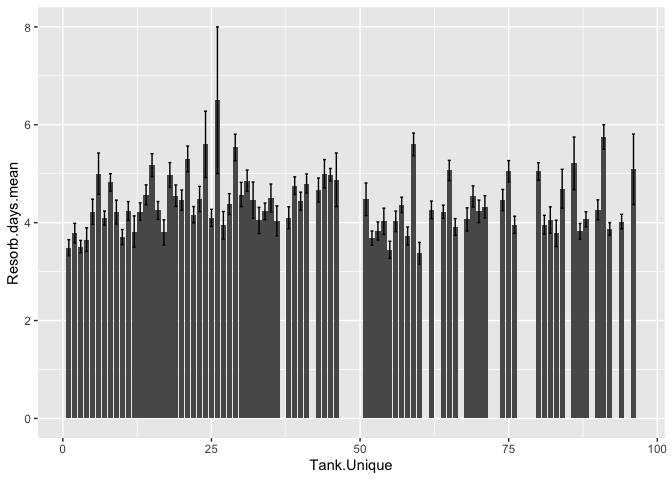
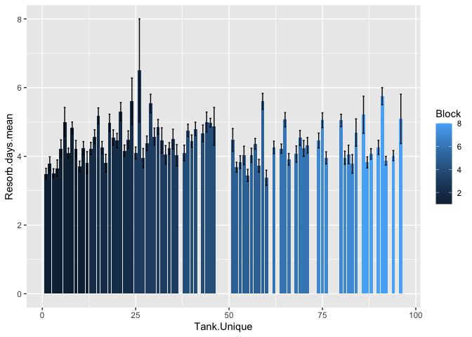
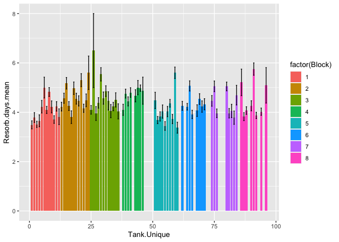
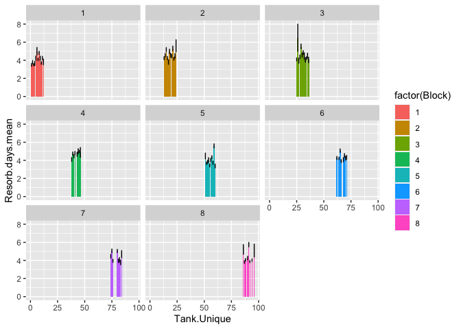
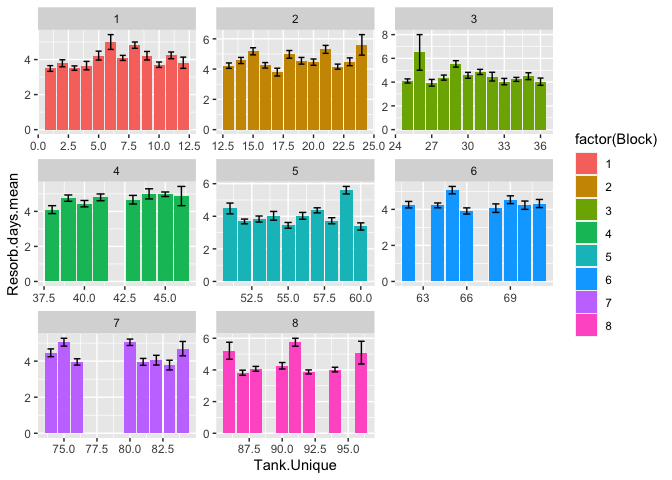
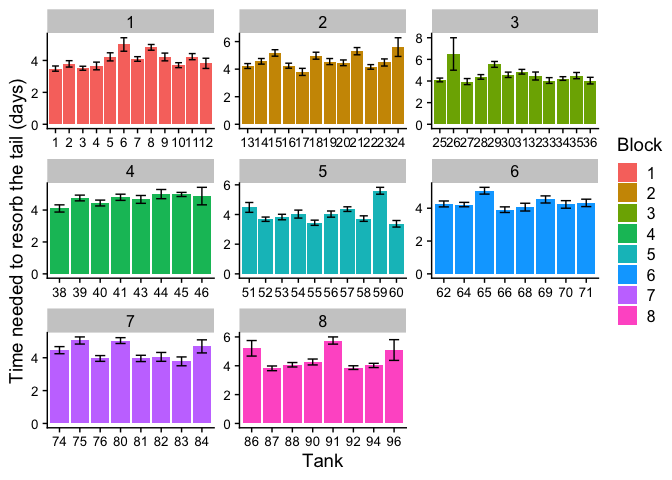
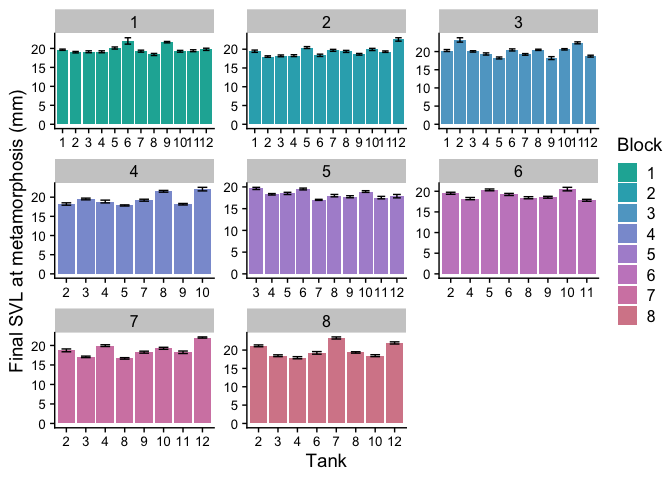

Chapter 9 Sample Answers
================
Justin Touchon
8/3/2021

This page provides sample answers to the assignment at the end of
Chapter 9 of Applied Statistics with R: A Practical Guide for the Life
Sciences by Justin Touchon. Chapter 9 focuses on *Advanced Data
Wrangling and Plotting*. Throughout the book you have been learning the
basis for these skills bit by bit, but Chapter 9 really aims to solidify
and further your understanding of data manipulation (primarily using the
package ***dplyr***, but others as well) and making effective graphics
with ***ggplot2***. The magic really happens when you integrate these
two skills together!

There was only one very open ended assignment listed at the end of
Chapter 9. I will explore a few different options, but the possibilities
are sort of endless here.

<span style="color: #009933;">

# Question 1

**Your goal is to pick a variable (final SVL, time to resorb the tail,
etc.) and make a bargraph that shows the mean and standard error for
each tank in the experiment. Make sure to give it meaningful axis titles
and all that.**

</span>

As always, let’s load any packages we will need. Here, we can load
pretty much everything we need with the ***tidyverse*** collection of
packages. I’ll also throw in ***cowplot*** of course.

``` r
library(tidyverse)
library(cowplot)
```

Alright, what should we examine? There are so many possibilities!

The key to this assignment that is a little different from what you did
in the chapter is that you want to plot each tank. Since you are also
supposed to have error bars for each bar, that means using the raw data
(*RxP.clean*) instead of the summarized data (*RxP.byTank*). Let’s make
sure we have those data loaded in and ready to go.

``` r
RxP.clean<-read.csv("~/Desktop/Biostats_class/RxP/RxP_clean.csv", stringsAsFactors = T)
#I'm going to go ahead and make the logged versions of these variables
RxP.clean$log.SVL.final<-log(RxP.clean$SVL.final)
RxP.clean$log.Age.FromEmergence<-log(RxP.clean$Age.FromEmergence)
RxP.clean$log.Age.DPO<-log(RxP.clean$Age.DPO)
RxP.clean$log.Mass.final<-log(RxP.clean$Mass.final)
#Remember to reorder the Pred factor
RxP.clean$Pred<-factor(RxP.clean$Pred, levels=c("C","NL","L"))
str(RxP.clean)
```

    ## 'data.frame':    2493 obs. of  18 variables:
    ##  $ Ind                  : int  1 2 3 4 5 6 7 8 9 10 ...
    ##  $ Block                : int  5 5 5 5 5 5 5 2 2 1 ...
    ##  $ Tank                 : int  7 4 4 7 10 4 4 5 4 1 ...
    ##  $ Tank.Unique          : int  55 52 52 55 58 52 52 17 16 1 ...
    ##  $ Hatch                : Factor w/ 2 levels "E","L": 1 2 2 1 2 2 2 1 2 2 ...
    ##  $ Pred                 : Factor w/ 3 levels "C","NL","L": 2 1 1 2 3 1 1 3 1 2 ...
    ##  $ Res                  : Factor w/ 2 levels "Hi","Lo": 1 1 1 1 1 1 1 1 1 1 ...
    ##  $ Age.DPO              : int  35 35 35 35 36 36 36 39 39 39 ...
    ##  $ Age.FromEmergence    : int  1 1 1 1 2 2 2 5 5 5 ...
    ##  $ SVL.initial          : num  18 17.7 18.1 16.8 18.7 17.5 17.3 19.6 16.5 17.5 ...
    ##  $ Tail.initial         : num  5.4 1.1 5 6.4 6.3 4.4 1.3 1.5 2 5.1 ...
    ##  $ SVL.final            : num  17 18 17.8 17.1 19.3 17.8 17.9 19.6 17.7 19.5 ...
    ##  $ Mass.final           : num  0.38 0.35 0.41 0.3 0.46 0.3 0.42 0.5 0.33 0.46 ...
    ##  $ Resorb.days          : int  3 3 3 3 3 4 2 2 2 3 ...
    ##  $ log.SVL.final        : num  2.83 2.89 2.88 2.84 2.96 ...
    ##  $ log.Age.FromEmergence: num  0 0 0 0 0.693 ...
    ##  $ log.Age.DPO          : num  3.56 3.56 3.56 3.56 3.58 ...
    ##  $ log.Mass.final       : num  -0.968 -1.05 -0.892 -1.204 -0.777 ...

We will explore two different variables, time to resorb the tail
(*Resorb.days*) and final SVL at metamorphosis (*SVL.final*). The basic
process will be the same for each variable.

1.  Group the data and calculate means and standard errors.
2.  Plot those data for each tank in the experiment.

## Time needed to fully resorb the tail after leaving the water

The first thing we need to do is summarize the data for each tank. You
will want to make sure you group the data by *Tank.Unique* and not just
*Tank*. Why you ask? Because summarizing based on just *Tank* would lump
tanks together across blocks, which is certainly not what we want. That
said, you could use *Tank* as a grouping variable if you also included
*Block*, since that would correctly separate each individual tank.

``` r
RxP.clean %>%
  group_by(Tank.Unique) %>%
  summarize(Resorb.days.mean = mean(Resorb.days),
            Resorb.days.SD = sd(Resorb.days),
            Resorb.days.N = length(Resorb.days)) %>%
  mutate(Resorb.days.SE = Resorb.days.SD/sqrt(Resorb.days.N))
```

    ## # A tibble: 78 x 5
    ##    Tank.Unique Resorb.days.mean Resorb.days.SD Resorb.days.N Resorb.days.SE
    ##          <int>            <dbl>          <dbl>         <int>          <dbl>
    ##  1           1             3.49          1.12             47          0.163
    ##  2           2             3.79          1.30             42          0.200
    ##  3           3             3.51          0.843            45          0.126
    ##  4           4             3.65          1.23             26          0.241
    ##  5           5             4.22          1.61             40          0.254
    ##  6           6             5             1.20              8          0.423
    ##  7           7             4.09          0.947            43          0.144
    ##  8           8             4.82          1.12             39          0.179
    ##  9           9             4.22          1.17             23          0.243
    ## 10          10             3.70          1.02             44          0.154
    ## # … with 68 more rows

Okay, that worked to create a summarized data frame to use for plotting.
I didn’t want to create a new object, so I’m just going to copy that
code and use it for plotting in the next step. Just like we did before,
we can pipe the summarized data to **ggplot()**. The most basic version
of the figure might look like this.

``` r
RxP.clean %>%
  group_by(Tank.Unique) %>%
  summarize(Resorb.days.mean = mean(Resorb.days),
            Resorb.days.SD = sd(Resorb.days),
            Resorb.days.N = length(Resorb.days)) %>%
  mutate(Resorb.days.SE = Resorb.days.SD/sqrt(Resorb.days.N)) %>%
  ggplot(data=., aes(x=Tank.Unique, y=Resorb.days.mean))+
    geom_col()+
    geom_errorbar(aes(ymin=Resorb.days.mean-Resorb.days.SE, 
                      ymax=Resorb.days.mean+Resorb.days.SE), 
                  width=0.5)
```

<!-- -->

We can make this figure a little more interesting though. For example,
we could also include *Block* as a grouping variable, which would then
allow us to facet or color based on Block. But, as we will see, that can
cause some wierd things to happen.

``` r
RxP.clean %>%
  group_by(Block, Tank.Unique) %>%
  summarize(Resorb.days.mean = mean(Resorb.days),
            Resorb.days.SD = sd(Resorb.days),
            Resorb.days.N = length(Resorb.days)) %>%
  mutate(Resorb.days.SE = Resorb.days.SD/sqrt(Resorb.days.N)) %>%
  ggplot(data=., aes(x=Tank.Unique, y=Resorb.days.mean, fill=Block))+
    geom_col()+
    geom_errorbar(aes(ymin=Resorb.days.mean-Resorb.days.SE, 
                      ymax=Resorb.days.mean+Resorb.days.SE), 
                  width=0.5)
```

    ## `summarise()` has grouped output by 'Block'. You can override using the `.groups` argument.

<!-- -->

So what happened there? Since *Block* is a continuous variable, R
decided color our bars with a gradient from dark blue to light blue. We
could get around this in two ways.

1.  We could use mutate to make *Block* a factor in the first part of
    the code.
2.  We could just specify that we want *Block* to be a factor directly
    in the first line of the **ggplot()** code. Let’s do that one. We
    can do that by just placing the name of our variable, in this case
    *Block* inside the function **factor()**.

``` r
RxP.clean %>%
  group_by(Block, Tank.Unique) %>%
  summarize(Resorb.days.mean = mean(Resorb.days),
            Resorb.days.SD = sd(Resorb.days),
            Resorb.days.N = length(Resorb.days)) %>%
  mutate(Resorb.days.SE = Resorb.days.SD/sqrt(Resorb.days.N)) %>%
  ggplot(data=., aes(x=Tank.Unique, y=Resorb.days.mean, fill=factor(Block)))+
    geom_col()+
    geom_errorbar(aes(ymin=Resorb.days.mean-Resorb.days.SE, 
                      ymax=Resorb.days.mean+Resorb.days.SE), 
                  width=0.5)
```

    ## `summarise()` has grouped output by 'Block'. You can override using the `.groups` argument.

<!-- -->

That’s starting to look nice. What if we wanted to facet the different
blocks into separate panels?

``` r
RxP.clean %>%
  group_by(Block, Tank.Unique) %>%
  summarize(Resorb.days.mean = mean(Resorb.days),
            Resorb.days.SD = sd(Resorb.days),
            Resorb.days.N = length(Resorb.days)) %>%
  mutate(Resorb.days.SE = Resorb.days.SD/sqrt(Resorb.days.N)) %>%
  ggplot(data=., aes(x=Tank.Unique, y=Resorb.days.mean, fill=factor(Block)))+
    geom_col()+
    geom_errorbar(aes(ymin=Resorb.days.mean-Resorb.days.SE, 
                      ymax=Resorb.days.mean+Resorb.days.SE), 
                  width=0.5)+
    facet_wrap(facets=.~Block)
```

    ## `summarise()` has grouped output by 'Block'. You can override using the `.groups` argument.

<!-- -->

Whoa, that probably isn’t what we expected! This is because when we
facet a plot, by default the x-axis is constrained to be the same across
every panel. Thus, the x-axis goes from 1-98 in each panel. Once again,
there are two ways to work around this.

1.  We could change our grouping variable to be *Tank* instead of
    *Tank.Unique*. Since we also group by *Block*, we will still see
    every tank.
2.  We could specify that we want the x-axis to be different in each
    panel of the faceted plot. We do that by specifying *scales=“free”*
    in the **facet\_wrap()** function. That is what I’m going to do.

``` r
RxP.clean %>%
  group_by(Block, Tank.Unique) %>%
  summarize(Resorb.days.mean = mean(Resorb.days),
            Resorb.days.SD = sd(Resorb.days),
            Resorb.days.N = length(Resorb.days)) %>%
  mutate(Resorb.days.SE = Resorb.days.SD/sqrt(Resorb.days.N)) %>%
  ggplot(data=., aes(x=Tank.Unique, y=Resorb.days.mean, fill=factor(Block)))+
    geom_col()+
    geom_errorbar(aes(ymin=Resorb.days.mean-Resorb.days.SE, 
                      ymax=Resorb.days.mean+Resorb.days.SE), 
                  width=0.5)+
    facet_wrap(facets=.~Block, scales="free")
```

    ## `summarise()` has grouped output by 'Block'. You can override using the `.groups` argument.

<!-- -->

Cool! We can see here that it would be more intuitive to specify that
*Tank.Unique* should be a factor, like we did for *Block*. Since we’ve
figured out the basics of our plot, I’m going to go ahead and fix up the
axis labels and everything else here. In the code below I’ve done a
bunch of things.

1.  I’ve specified that *Tank.Unique* should be a factor.
2.  I’ve modified the x- and y-axis labels with the **labs()** function.
    I’ve also used this to change the title of the legend. Normally you
    might change the title of a legend using **scale\_fill\_manual()**
    but since I didn’t want to change the colors, this a more efficient
    way to accomplish the same job.
3.  I’ve specified to use the cowplot theme, which I like a lot.
4.  Unfortunately **theme\_cowplot()** makes the axis fonts a little
    *too big*, such that the numbers of the tanks became a little
    unreadable. Thus, I’ve used the **theme()** function to specify a
    slightly smaller font size.

``` r
RxP.clean %>%
  group_by(Block, Tank.Unique) %>%
  summarize(Resorb.days.mean = mean(Resorb.days),
            Resorb.days.SD = sd(Resorb.days),
            Resorb.days.N = length(Resorb.days)) %>%
  mutate(Resorb.days.SE = Resorb.days.SD/sqrt(Resorb.days.N)) %>%
  ggplot(data=., aes(x=factor(Tank.Unique), y=Resorb.days.mean, fill=factor(Block)))+
    geom_col()+
    geom_errorbar(aes(ymin=Resorb.days.mean-Resorb.days.SE, 
                      ymax=Resorb.days.mean+Resorb.days.SE), 
                  width=0.5)+
    facet_wrap(facets=.~Block, scales="free")+
    labs(x="Tank", y="Time needed to resorb the tail (days)", fill="Block")+
    theme_cowplot()+
    theme(axis.text.x = element_text(size=10), axis.text.y = element_text(size=10))
```

    ## `summarise()` has grouped output by 'Block'. You can override using the `.groups` argument.

<!-- -->

## Final SVL at metamorphosis

Now that we’ve worked through all that to make a nice figure, I wanted
to show how easy it is to make a new figure using the preexisting code.
Below, I’ve just modified the text above to summarize a different
variable (*SVL.final*). All I did was a “find and replace” to swap
*Resorb.days* for *SVL.final*. So easy! To make this figure a little
different, I did change the colors for the plot and I grouped it by
*Tank* instead of *Tank.Unique*, which I did by specifying
**scale\_fill\_hue()**. This is essentially a special version of
**scale\_fill\_manual()** that lets you create a gradient of colors
based on two points in a color wheel. I chose to start in the greens and
progress to the end of the color wheel (blue/purple). I also specified a
low value for the chroma, or purity of the color (via the *c=*
argument). There are so many ways you can play with color in
***ggplot2***!

``` r
RxP.clean %>%
  group_by(Block, Tank) %>%
  summarize(SVL.final.mean = mean(SVL.final),
            SVL.final.SD = sd(SVL.final),
            SVL.final.N = length(SVL.final)) %>%
  mutate(SVL.final.SE = SVL.final.SD/sqrt(SVL.final.N)) %>%
  ggplot(data=., aes(x=factor(Tank), y=SVL.final.mean, fill=factor(Block)))+
    geom_col()+
    geom_errorbar(aes(ymin=SVL.final.mean-SVL.final.SE, 
                      ymax=SVL.final.mean+SVL.final.SE), 
                  width=0.5)+
    facet_wrap(facets=.~Block, scales="free")+
    labs(x="Tank", y="Final SVL at metamorphosis (mm)", fill="Block")+
    theme_cowplot()+
    theme(axis.text.x = element_text(size=10), axis.text.y = element_text(size=10))+
    scale_fill_hue(h=c(180,360), c=50)
```

    ## `summarise()` has grouped output by 'Block'. You can override using the `.groups` argument.

<!-- -->
